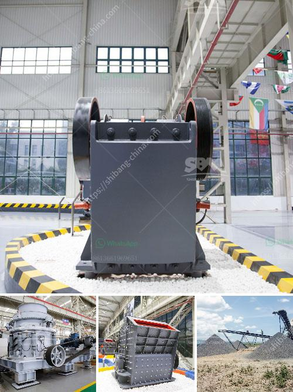

<h3>ball mill catalogue</h3>
A ball mill is a type of grinding mill, which is used to grind materials into extremely fine powder. Its main purpose is to reduce the size of the materials to a granular level. A ball mill consists of a hollow cylindrical shell that rotates about its axis. It is partially filled with balls, which can be made of different materials such as stainless steel, ceramic, or rubber.

A ball mill works by using balls to grind the materials. As the balls rotate inside the mill, they collide with each other and the materials, breaking them down into smaller particles. This process is known as mechanical alloying.

Most ball mills operate at a critical speed, meaning that they rotate at a speed that is optimal for grinding. The critical speed depends on various factors, including the size and shape of the mill, the type and amount of grinding media used, and the properties of the materials being ground.

Ball mills are widely used in various industries, including mining, construction, and pharmaceuticals. They are commonly used for grinding materials such as cement, silicates, refractory materials, fertilizers, glass ceramics, and ore dressing.

To choose the right ball mill for your specific needs, it is important to consider several factors. Firstly, you need to determine the size of the mill you require. This will depend on the amount of material you need to grind and the final particle size you desire. Next, you should consider the type of material and grinding media you will be using. Different materials require different types of grinding media to achieve the desired results.

When selecting a ball mill, you should also consider the capacity and energy consumption. The capacity refers to the maximum amount of material that the mill can process in a given time. The energy consumption is an important factor as it determines the operating cost of the mill. A ball mill with lower energy consumption will be more cost-effective in the long run.

When searching for a ball mill, it is helpful to refer to a ball mill catalogue. This catalogue usually contains detailed information about various types of ball mills, including their specifications, capacity, energy consumption, and application range. It will help you compare different models and choose the one that best suits your needs.

In conclusion, a ball mill is a crucial equipment for grinding materials into fine powder. When selecting a ball mill, it is important to consider factors such as the size, type of material, grinding media, capacity, and energy consumption. Referring to a ball mill catalogue can be helpful in choosing the right ball mill for your specific requirements.
<h3>Contact us</h3><ul><li><strong>Whatsapp:&nbsp;<a href="https://wa.me/8613661969651">+8613661969651</a></strong></li><li><a href="https://swt.shibang-china.com/?git&amp;zhl&amp;ball mill catalogue"><strong>Online Service(chat now)</strong></a></li></ul><h3>Related</h3><ul><li><a href='mobile crusher made in turkey.md'>mobile crusher made in turkey</a></li><li><a href='grinding plant material gold.md'>grinding plant material gold</a></li><li><a href='dolomite processing plants from germany.md'>dolomite processing plants from germany</a></li><li><a href='gemstone mining in zambia.md'>gemstone mining in zambia</a></li><li><a href='small gold rock crushers with chain.md'>small gold rock crushers with chain</a></li></ul>