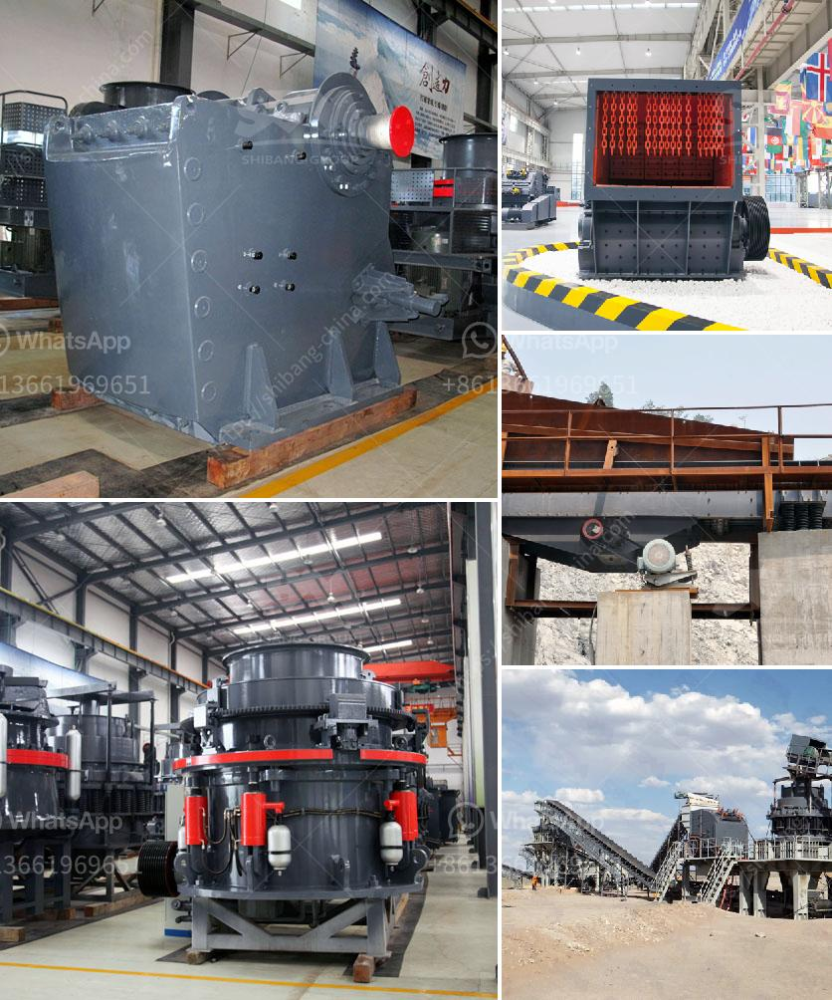

<h3>ball mill conique occasion allemand</h3>
The ball mill, also known as a conical mill in German, is a key piece of equipment that is widely used in the mining industry, especially in the ore and cement industries. It operates by rotating a cylinder with steel grinding balls, which act as the grinding media. The material to be ground is fed into the cylinder, and as the mill rotates, the balls cascade and crush the material, resulting in a finely ground product.

There are several reasons why a ball mill is indispensable in the mining industry. Firstly, it allows for the grinding of large quantities of material, which is crucial in the production of valuable minerals. The size reduction process is essential for liberating valuable particles from the gangue, or waste material, allowing them to be separated and recovered.

Furthermore, the ball mill's conical shape ensures more efficient grinding. The conical design provides a greater surface area for the grinding media, increasing the grinding action and reducing the energy required for comminution. This results in a more cost-effective operation, with lower power consumption and higher productivity.

In addition, the conical ball mill offers better control over the particle size distribution. The size of the grinding media can be adjusted, allowing for precise control over the final product's fineness. This is particularly important in the cement industry, where the particle size distribution affects the strength and quality of the final product.

Another advantage of the ball mill is its versatility. It can be used for both wet and dry grinding, allowing for greater flexibility in processing various types of minerals and ores. Additionally, different materials can be used for the grinding media, allowing for further customization and optimization of the grinding process.

When considering purchasing a ball mill, it is important to choose a reputable manufacturer. German manufacturers are well-known for their precision engineering and high-quality products. A ball mill designed and manufactured by a German company is likely to be reliable and durable, ensuring long-term operation and minimal maintenance.

Overall, the ball mill conique occasion allemand is a valuable piece of equipment in the mining industry. Its conical shape, efficient grinding action, and versatile design make it an essential tool for processing various minerals and ores. Whether used for wet or dry grinding, a well-designed and manufactured ball mill will provide reliable performance, energy efficiency, and precise control over the particle size distribution.
<h3>Contact us</h3><ul><li><strong>Whatsapp:&nbsp;<a href="https://wa.me/8613661969651">+8613661969651</a></strong></li><li><a href="https://swt.shibang-china.com/?git&amp;zhl&amp;ball mill conique occasion allemand"><strong>Online Service(chat now)</strong></a></li></ul><h3>Related</h3><ul><li><a href='ball mill suppliers in south africa.md'>ball mill suppliers in south africa</a></li><li><a href='stone crushing feasibility study.md'>stone crushing feasibility study</a></li><li><a href='mineral used for making talcum powder.md'>mineral used for making talcum powder</a></li><li><a href='price list for belt conveyor pdf.md'>price list for belt conveyor pdf</a></li><li><a href='iron crushing equipment for sale.md'>iron crushing equipment for sale</a></li></ul>