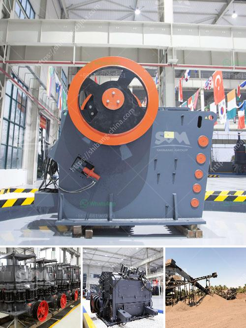

<h3>ball mill for mineral grinding india</h3>
Ball mill for mineral grinding India is the key equipment for grinding after the crushing process, which is widely used in the manufacture industries, such as cement, silicate, new building material, refractory material, fertilizer, ferrous metal, nonferrous metal and glass ceramics and can be used for the dry and wet grinding for all kinds of ores and other grindable materials. It is widely used in the production of cement, silicate products, new building materials, refractory materials, fertilizers, black and non-ferrous metal dressings and glass ceramics, dry or wet grinding of various ores and other grindable materials.

The ball mill machine is composed of a horizontal cylinder, a hollow shaft for feeding and discharging materials, and a grinding head. The cylinder is a long cylinder with grinding media inside. The barrel of the ball mill rotates along with the material being ground, causing the grinding media to impact and grind the material fed into the cylinder to a certain size. The material is ground into a powder with a specific fineness through the grinding action of the grinding medium.

India is rich in mineral resources, and one of those is limestone. With the continuous development of society and the progress of science and technology, the demand for limestone in India is increasing. Limestone is widely used in the construction industry, mainly as an aggregate for concrete. The demand for limestone grinding equipment is also increasing.

The ball mill for mineral grinding India is an important grinding equipment in both power supply field and mining industry, where it is used for fine powder making plant, according to different materials, the lining plates can be different. The inner lining plate could be made from ceramic, rubber or steel material. And different lining plates could be used for different capacity.

The fineness required in the grinding process also affects the choice of grinding balls. There are various types of grinding media available in the market, which vary in their size, shape, and specific gravity. The appropriate choice of grinding media mainly depends on the grinding process requirements, the type of material being ground, and the specific energy consumption of the milling operation.

In India, there are some manufacturers who provide high-quality ball mills for mineral grinding. They manufacture grinding equipment that is suitable for the grinding of various ores and minerals, such as iron ore, copper ore, gold ore, bauxite, limestone, etc., with different hardness levels. These manufacturers understand the importance of grinding and have designed grinding equipment that ensures efficient and effective grinding operations.

In conclusion, the ball mill for mineral grinding India is a significant grinding equipment applied to grind granular materials. The machine is mainly used to grind various kinds of mine and other materials, or to select the mine. Ball mill is widely used in building material, chemical industry, etc. There are two ways of grinding: the dry process and the wet process. It can be divided into tabular type and flowing type according to different forms of discharging material. Thus, it is widely used in the production of metal mining, non-metallic mining and other industries.
<h3>Contact us</h3><ul><li><strong>Whatsapp:&nbsp;<a href="https://wa.me/8613661969651">+8613661969651</a></strong></li><li><a href="https://swt.shibang-china.com/?git&amp;zhl&amp;ball mill for mineral grinding india"><strong>Online Service(chat now)</strong></a></li></ul><h3>Related</h3><ul><li><a href='harare changfa diesel engine.md'>harare changfa diesel engine</a></li><li><a href='mobile jaw crusher dealers south africa.md'>mobile jaw crusher dealers south africa</a></li><li><a href='kaolin processing line.md'>kaolin processing line</a></li><li><a href='stone crusher in thailand.md'>stone crusher in thailand</a></li><li><a href='used gupsum board plant sale.md'>used gupsum board plant sale</a></li></ul>