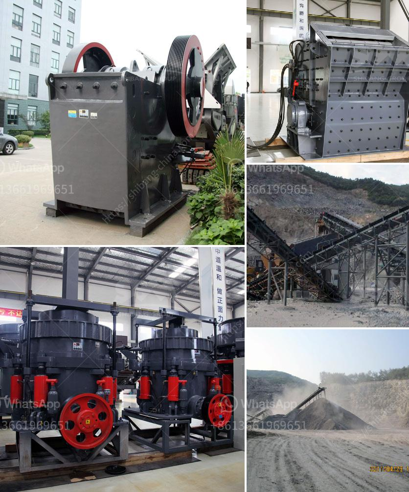

<h3>ball mill for pigment</h3>
A ball mill for pigment is a grinding device that is used to mechanically break down pigments into fine particles, which are then dispersed in a liquid medium for further usage. These devices are popularly used in the production of paints, inks, and coatings.

The main components of a ball mill for pigment include a milling chamber, milling media (balls or beads), and an agitator or rotor. The milling chamber is filled with the pigment mixture, and milling media are then added. When the motor is turned on, the agitator rotates, causing the milling media to collide with each other and with the pigment particles.

The collisions, combined with the high energy input from the rotating agitator, cause the pigment particles to break down into smaller sizes. The milling media also provide the additional shearing force required for this particle size reduction process. As a result, the pigment particles are broken down to a desired fineness, typically ranging from a few micrometers to less than a micron.

The design and size of the ball mill for pigment vary depending on the viscosity and other properties of the pigment material being processed. For highly viscous materials, a closed chamber design with a high-speed rotor, such as a bead mill, is often preferred. In contrast, for low viscosity materials, an open chamber design with lower rotational speeds may be sufficient.

The choice of milling media also plays a crucial role in determining the final particle size and quality of the pigment dispersion. Typically, ceramic, steel, or glass beads are used as milling media due to their high hardness and wear resistance. The size and shape of the beads can be customized to achieve the desired particle size distribution.

Modern ball mills for pigment often come with advanced features such as temperature control, cooling systems, and varying speed settings. These features ensure that the milling process is efficient and consistent, while also preventing overheating and excessive wear on the equipment.

In conclusion, a ball mill for pigment is a versatile and essential device in the production of paints, inks, and coatings. It provides an efficient and uniform method for achieving the desired particle size and dispersion quality. With advancements in technology, these mills have become more sophisticated and user-friendly, allowing for precise control over the milling process.
<h3>Contact us</h3><ul><li><strong>Whatsapp:&nbsp;<a href="https://wa.me/8613661969651">+8613661969651</a></strong></li><li><a href="https://swt.shibang-china.com/?git&amp;zhl&amp;ball mill for pigment"><strong>Online Service(chat now)</strong></a></li></ul><h3>Related</h3><ul><li><a href='50 tph stone crusher plant.md'>50 tph stone crusher plant</a></li><li><a href='washing plant for silica.md'>washing plant for silica</a></li><li><a href='grinding machinery for sale in guatemala.md'>grinding machinery for sale in guatemala</a></li><li><a href='granite stone crusher india size.md'>granite stone crusher india size</a></li><li><a href='mini cement plant in pakistan.md'>mini cement plant in pakistan</a></li></ul>