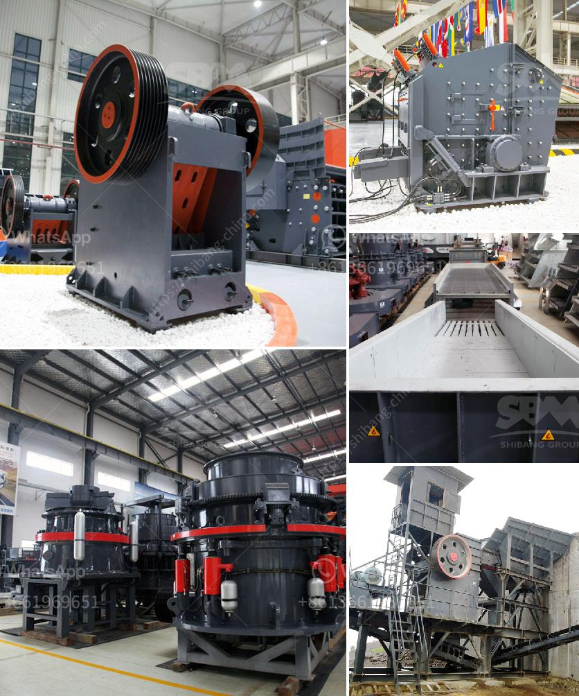

<h3>ball mill for quartz grinding gujarat</h3>
Quartz is a mineral with extremely high wear resistance and high hardness. It is also a valuable natural resource. To make full use of quartz sand, it is necessary to grind it into powder. Quartz grinding is an essential step in quartz processing. Quartz grinding mills are widely used in various industries such as cement, silicate, new building materials, refractory materials, fertilizers, ferrous metals, non-ferrous metals, glass ceramics, etc. The ball mill is the key equipment for crushing quartz materials after they are crushed.

The ball mill is an important piece of equipment for grinding crushed materials. It has a wide range of applications and can be used for grinding various ores, such as iron ore, gold ore, limestone, bauxite, calcite, barite, gypsum, etc. It can be used in mineral processing, building materials, metallurgy, chemicals, and other industries.

Gujarat is a state in western India known for its industrial development. It has a rich mineral resource base and is a hub for various industries. Gujarat has many quartz deposits, making it an ideal location for quartz grinding mills. In recent years, Gujarat has witnessed tremendous growth in industries such as ceramics, glass, and refractory materials, which require high-quality quartz powder. 

The ball mill for quartz grinding in Gujarat is well designed and produced with advanced technology. The grinding body is made of wear-resistant materials and the length diameter ratio of the mill is optimized to ensure the grinding efficiency and performance. The lining plate in the mill adopts wear-resistant materials to prolong the service life of the equipment.

The ball mill for quartz grinding in Gujarat can be divided into two types: dry type and wet type. Dry type ball mill mainly used for stone powder making. The fineness of the grinding process is controlled by the grinding time. The wet type ball mill can grind the quartz materials with a moisture content of approximately 10%. Grinding is conducted in a concentrated slurry with a certain amount of water.

The ball mill for quartz grinding in Gujarat consumes less energy and produces less noise. It reduces the labor cost and improves the overall production efficiency. The grinding process is environmentally friendly, with less dust and noise pollution.

In conclusion, the ball mill for quartz grinding in Gujarat is a high-quality equipment used for grinding quartz materials. It has won the recognition and favor of many quartz powder manufacturers. With the development of Gujarat's economy and the improvement of people's living standards, the demand for quartz powder is increasing, and the ball mill plays a vital role in promoting the development of the quartz grinding industry in Gujarat.
<h3>Contact us</h3><ul><li><strong>Whatsapp:&nbsp;<a href="https://wa.me/8613661969651">+8613661969651</a></strong></li><li><a href="https://swt.shibang-china.com/?git&amp;zhl&amp;ball mill for quartz grinding gujarat"><strong>Online Service(chat now)</strong></a></li></ul><h3>Related</h3><ul><li><a href='germany stone crushing plants.md'>germany stone crushing plants</a></li><li><a href='financial projections for a ore mining company.md'>financial projections for a ore mining company</a></li><li><a href='used nd hand coal crusher sizer.md'>used nd hand coal crusher sizer</a></li><li><a href='double roll crusher indonesia.md'>double roll crusher indonesia</a></li><li><a href='wet ball milling.md'>wet ball milling</a></li></ul>