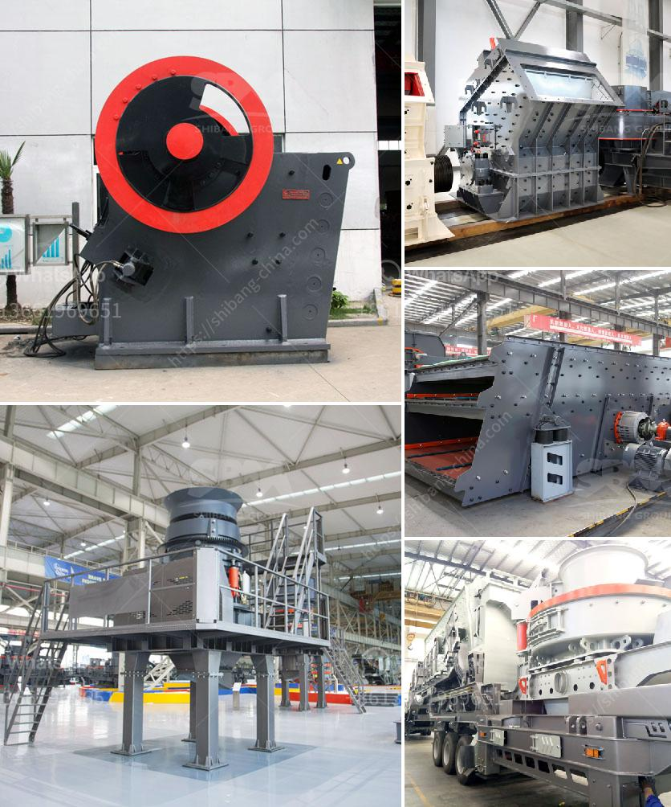

<h3>ball mill for sale in india</h3>
If you are searching for a ball mill for sale in India, you may have a lot of options to choose from. With the advancements in technology, the industry is booming and there are various manufacturers who provide ball mills for different purposes. 

A ball mill is a cylindrical machine used to grind materials into fine powders. It works on the principle of impact and attrition: size reduction is done by impact as the balls drop from near the top of the shell. A ball mill consists of a hollow cylindrical shell rotating about its axis. The axis of the shell may be horizontal or at a small angle to the horizontal. 

There are several factors to consider when purchasing a ball mill. The size and capacity of the mill should be suitable for your requirements. Consider the materials you will be grinding, as different mills are designed for different materials. The speed and rotation of the mill also matter, as it affects the grinding efficiency.

There are various types of ball mills available in the market, such as batch mills, continuous mills, vibratory mills, etc. Each type has its own advantages and can be used for different applications. Some ball mills are used in industries like mining, construction, ceramics, and chemicals.

When choosing a ball mill for sale in India, it is important to do thorough research and compare the options available. Look for reputed manufacturers who have a good track record of providing high-quality equipment. Check for customer reviews and testimonials to ensure the reliability of the product. 

Furthermore, consider the after-sales service provided by the manufacturer. A good manufacturer will provide technical support and assistance whenever required. It is also important to consider the cost and overall value for money.

In conclusion, finding a ball mill for sale in India can be a daunting task, but with proper research and consideration, you can find the right one for your needs. Take into account factors like size, capacity, materials, and after-sales service. With the right ball mill, you can enhance your productivity and efficiency in various industries.
<h3>Contact us</h3><ul><li><strong>Whatsapp:&nbsp;<a href="https://wa.me/8613661969651">+8613661969651</a></strong></li><li><a href="https://swt.shibang-china.com/?git&amp;zhl&amp;ball mill for sale in india"><strong>Online Service(chat now)</strong></a></li></ul><h3>Related</h3><ul><li><a href='buy mobile crusher in usa.md'>buy mobile crusher in usa</a></li><li><a href='used portable rock crusher for sale.md'>used portable rock crusher for sale</a></li><li><a href='iron processing plant price.md'>iron processing plant price</a></li><li><a href='cement plant tons per day.md'>cement plant tons per day</a></li><li><a href='blast furnace slag grinding machine india.md'>blast furnace slag grinding machine india</a></li></ul>