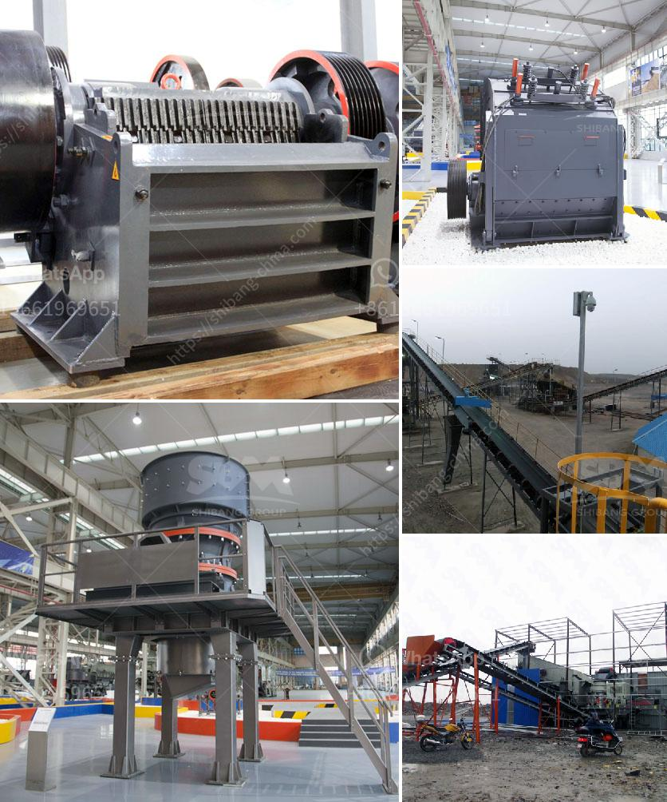

<h3>ball mill for sale in</h3>
Ball mills are a fundamental part of the manufacturing industry in the USA as well as around the world. Ball mills crush material into various sizes and extract resources from mined materials. Pebble mills are a type of ball mill and are also used to reduce the size of hard materials, down to 1 micron or less.

Because of their fairly simple design, ball mills and pebble mills are less likely to need costly repairs (unlike other crushing or extraction equipment) making them an attractive option for companies on a budget.

One of the key advantages of ball mills is their ability to grind material into fine particles. The ball mill design allows for even higher fineness levels, as the particles are ground to a complete pass through the smallest sieve openings. This feature makes them perfect for certain industrial applications such as grinding catalysts, metal powders, and mechanical alloys.

Ball mills can also be used for mechanical alloying, where two or more materials are mixed together and then function as one solid mass. Mechanical alloying can increase the strength and hardness of the final product, and the process is often used to create alloys or silicon carbide composites.

Another advantage of the ball mill is that it can perform dry milling or wet milling, depending on the application. Wet milling involves suspending solids in a liquid and the resulting mixture is the slurry. Dry milling is the most common method of producing fine particles in most mineral industries. However, wet milling can also be used for material that endures prolonged wet grinding or when the specific surface area of the particles needs to be increased.

When considering a ball mill for your manufacturing or mineral production process, you might ask yourself, "Where can I find a good ball mill for sale?" Luckily, many companies offer high-quality ball mills that can be customized to meet the specific needs of your business.

One company that offers ball mills in the United States is FEECO International. FEECO’s engineers can customize ball mills to meet your company’s needs. They also offer complete ball mill refurbishing services. All spare parts are covered under the company's standard one-year warranty policy.

If you are looking for a good ball mill for sale, FEECO is the right choice. They offer quick turnaround times and reliable service. To learn more about ball mills or other equipment and services, contact FEECO today.

In summary, ball mills provide significant advantages over other types of crushing and grinding equipment, including lower maintenance costs, higher fineness levels, and customizability. If you are in the market for a new ball mill, FEECO can help. They offer a range of customizable options to meet your manufacturing needs and ensure that your company remains ahead of the competition.
<h3>Contact us</h3><ul><li><strong>Whatsapp:&nbsp;<a href="https://wa.me/8613661969651">+8613661969651</a></strong></li><li><a href="https://swt.shibang-china.com/?git&amp;zhl&amp;ball mill for sale in"><strong>Online Service(chat now)</strong></a></li></ul><h3>Related</h3><ul><li><a href='quartz stone crushing machine for stone industries.md'>quartz stone crushing machine for stone industries</a></li><li><a href='limestone rock crushing company.md'>limestone rock crushing company</a></li><li><a href='want to buy crusher pozzolan.md'>want to buy crusher pozzolan</a></li><li><a href='mobile crusher price list.md'>mobile crusher price list</a></li><li><a href='mills road crusher machine.md'>mills road crusher machine</a></li></ul>