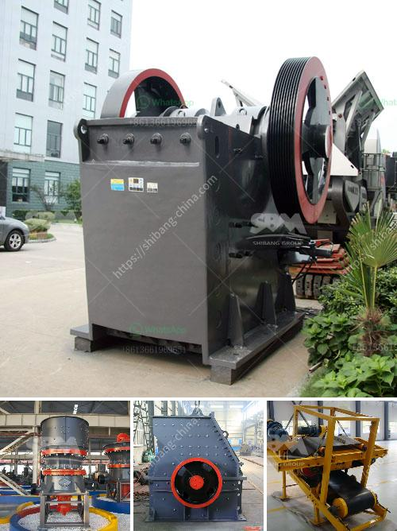

<h3>ball mill for sale manufacturers</h3>
A ball mill is a type of grinder used to grind materials into extremely fine powder for use in mineral dressing processes, paints, pyrotechnics, ceramics, and selective laser sintering. The ball mill is a key piece of equipment for grinding crushed materials and it is widely used in production lines for powders such as cement, silicates, refractory material, fertilizer, glass ceramics, etc. as well as for ore dressing of both ferrous and non-ferrous metals.

When looking for a ball mill for sale, one of the most important things to consider is the durability and performance of the machinery. A reputable manufacturer will provide a reliable product that meets the requirements of the customer and lasts for a long time. 

There are several manufacturers in the market who provide ball mills for sale. However, not all manufacturers are equally reliable or provide a high-quality product. It is important to research and find manufacturers who have a good track record and positive customer reviews. 

One of the ways to identify reliable manufacturers is to look for certifications such as ISO 9001, which ensures the manufacturer follows strict quality management standards. Additionally, checking for years of experience in the industry can also give an insight into the manufacturer's expertise and reputation.

Another important aspect to consider when choosing a ball mill manufacturer is their customer service. Good manufacturers will provide excellent customer support throughout the entire process, from pre-sales inquiries to after-sales service. This ensures that any issues or questions are resolved promptly, helping the customer make the most of their investment.

Additionally, it is also worth considering the warranty and maintenance services provided by the manufacturer. A good manufacturer will offer a warranty period for their products, giving customers peace of mind in case of any unforeseen issues.

In conclusion, when searching for a ball mill for sale, it is important to choose a reliable manufacturer who offers a high-quality product, has certifications, and provides excellent customer service. This ensures that the customer receives a durable and efficient ball mill that meets their requirements and delivers optimal performance.
<h3>Contact us</h3><ul><li><strong>Whatsapp:&nbsp;<a href="https://wa.me/8613661969651">+8613661969651</a></strong></li><li><a href="https://swt.shibang-china.com/?git&amp;zhl&amp;ball mill for sale manufacturers"><strong>Online Service(chat now)</strong></a></li></ul><h3>Related</h3><ul><li><a href='conveyor belts for sale in china.md'>conveyor belts for sale in china</a></li><li><a href='trommel screen for sale south africa.md'>trommel screen for sale south africa</a></li><li><a href='design for stone crusher plant.md'>design for stone crusher plant</a></li><li><a href='vertical grinding mill types for cement plants.md'>vertical grinding mill types for cement plants</a></li><li><a href='small gold crushing plant for sale.md'>small gold crushing plant for sale</a></li></ul>