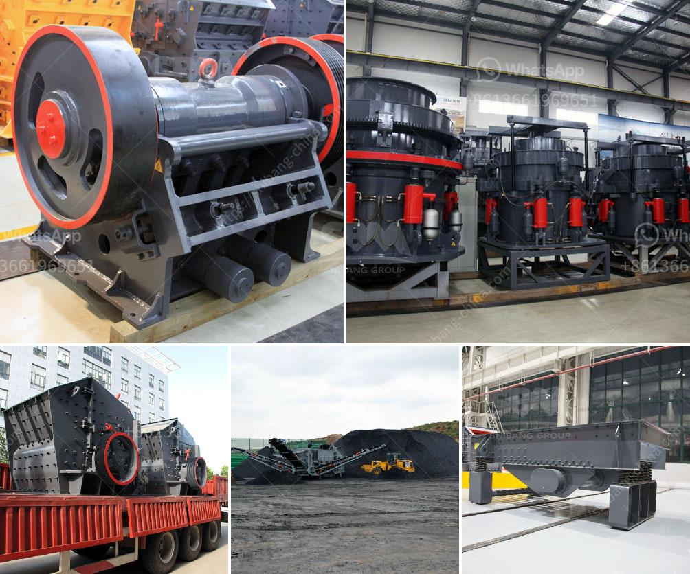

<h3>ball mill for sale uk</h3>
The ball mill is a key equipment for grinding materials, widely used in powder-making production line such as cement, silicate sand, new-type building material, refractory material, fertilizer, ore dressing of ferrous metal and non-ferrous metal, glass ceramics, etc. Ball mill can grind various ores and materials with dry type or wet type.

As a leading supplier of grinding machines, many customers from different countries all over the world are very interested in our ball mill for sale in the UK. With outstanding characteristics such as low running cost, high efficiency and excellent performance, the ball mill has been widely applied in various industries. It can be used for both dry and wet grinding. It is mainly used to grind materials such as ores, coal, cement, silicate, refractory materials, fertilizers, glass, ceramics, etc.

One of the selling points of our ball mill for sale in the UK is its ability to achieve high grinding efficiency with uniform particle and size distribution. During the grinding process, the material is crushed and ground into a fine powder by the rotating grinding media (steel balls). This ensures that the final product has a consistent particle size and shape, leading to better product quality and reduced energy consumption.

Furthermore, our ball mill for sale in the UK is designed with advanced technology and equipped with high-quality components, ensuring long-lasting performance and reliable operation. The machine is easy to operate and maintain, with low operating costs. In addition, the ball mill is equipped with a variety of safety devices, providing a safe and secure working environment for operators.

In conclusion, if you are looking for an efficient and reliable grinding machine, our ball mill for sale in the UK is a great choice. With its high grinding efficiency, uniform particle size distribution, and easy operation and maintenance, it can meet the requirements of various industries. Whether you are in the mining, cement, or chemical industry, our ball mill for sale in the UK will deliver excellent results and help you achieve your production goals.
<h3>Contact us</h3><ul><li><strong>Whatsapp:&nbsp;<a href="https://wa.me/8613661969651">+8613661969651</a></strong></li><li><a href="https://swt.shibang-china.com/?git&amp;zhl&amp;ball mill for sale uk"><strong>Online Service(chat now)</strong></a></li></ul><h3>Related</h3><ul><li><a href='lime stone extraction equipment india.md'>lime stone extraction equipment india</a></li><li><a href='2 micron limestone grinding unit in india.md'>2 micron limestone grinding unit in india</a></li><li><a href='screw conveyor for sand.md'>screw conveyor for sand</a></li><li><a href='kenya stone crusher.md'>kenya stone crusher</a></li><li><a href='raymond used mill for sale.md'>raymond used mill for sale</a></li></ul>