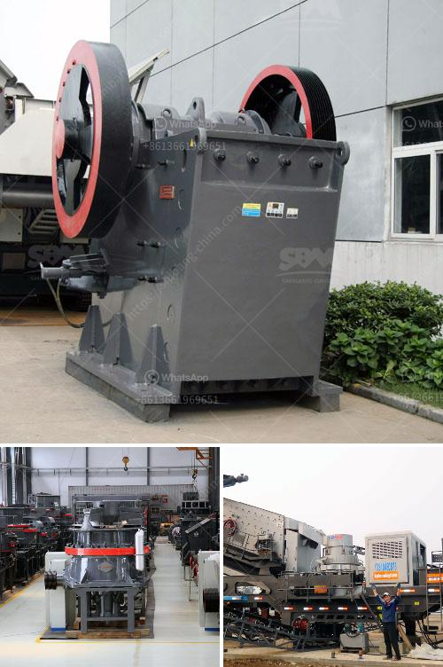

<h3>ball mill for size reduction</h3>
In various industries, size reduction is a crucial process required to produce particles of a desired size and distribution for various purposes. One of the most commonly used equipment for size reduction is a ball mill.

Ball mills are widely used in mineral processing, building materials, chemicals, new materials, ceramics, etc., to grind materials into fine powder. They are popular for their low power consumption, high efficiency, and stable performance.

A ball mill consists of a rotating cylindrical shell filled with grinding media such as balls made of steel, ceramic, or natural material. The rotation of the drum causes the grinding media to impact and grind the materials being processed. The result is a finely ground product ready for further processing or use.

One of the key advantages of using a ball mill for size reduction is its adaptability for different materials. It can grind a wide variety of materials, including minerals, ores, chemicals, and even some foods. The hardness, moisture content, and particle size distribution of the material can all affect the efficiency and performance of a ball mill. Therefore, it is important to choose the appropriate grinding media and optimize the operating conditions to achieve the desired particle size and distribution.

Another benefit of using a ball mill for size reduction is the precise control of particle size distribution. Typically, a ball mill operates with a discharge size range of 35 mesh to 400 mesh, or even finer. As the size of the particle being processed decreases, it becomes increasingly important to control the particle size distribution to ensure consistent and reliable product quality.

The efficiency of a ball mill for size reduction is influenced by several factors, including the rotational speed, size of the grinding media, the feed rate, and the size and hardness of the grinding media. Controlling these factors can help optimize the grinding process and improve the overall efficiency of a ball mill.

In recent years, advancements in ball mill design and manufacturing technology have further improved its performance and efficiency. For example, the introduction of the planetary ball mill has revolutionized the way size reduction is performed in this equipment. These mills feature multiple rotary chambers, each with its own grinding media, allowing for simultaneous grinding and mixing of different materials. This leads to increased efficiency, reduced processing time, and improved product quality.

In conclusion, the ball mill is a versatile and efficient equipment that can grind a wide range of materials for size reduction. It plays an important role in the production of fine particles, making it a crucial tool in various industries. With proper optimization of the operational parameters, a ball mill can provide consistent and reliable particle size reduction, leading to improved product quality and overall efficiency. As technology continues to advance, further enhancements in ball mill design and performance can be expected, further improving its capabilities and applications.
<h3>Contact us</h3><ul><li><strong>Whatsapp:&nbsp;<a href="https://wa.me/8613661969651">+8613661969651</a></strong></li><li><a href="https://swt.shibang-china.com/?git&amp;zhl&amp;ball mill for size reduction"><strong>Online Service(chat now)</strong></a></li></ul><h3>Related</h3><ul><li><a href='clay powder machine.md'>clay powder machine</a></li><li><a href='washing plant for silica.md'>washing plant for silica</a></li><li><a href='flow diagram by gypsum process.md'>flow diagram by gypsum process</a></li><li><a href='gypsum processing plant for sale.md'>gypsum processing plant for sale</a></li><li><a href='vertical vertical grinding machine.md'>vertical vertical grinding machine</a></li></ul>