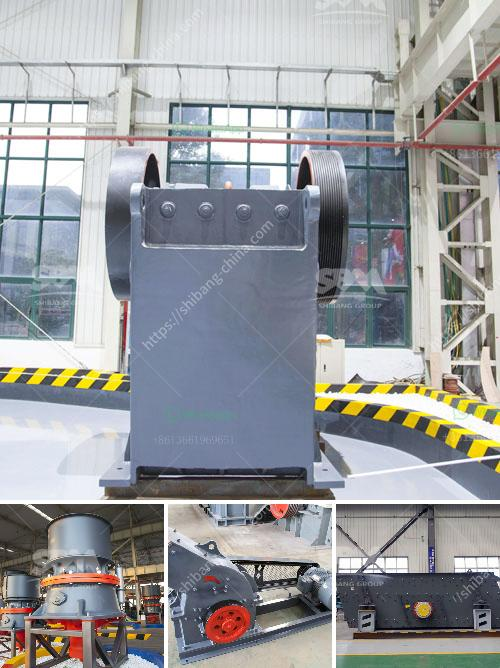

<h3>ball mill hou feng in china</h3>
Located in the heart of China, the Ball Mill Hou Feng has emerged as a leading industrial grinding facility, catering to a wide range of clients across various industries. With its high-quality machinery and cutting-edge technologies, this versatile facility has revolutionized the grinding processes, improving efficiency and productivity in factories nationwide.

Ball Mill Hou Feng is a state-of-the-art grinding facility that specializes in the production of finely ground materials for various applications. Equipped with a diverse range of mills and advanced technology, the facility has gained prominence within China's manufacturing industry.

The success of Ball Mill Hou Feng can be partly attributed to its investment in state-of-the-art equipment and facilities. The facility boasts a wide range of mills including ball mills, rod mills, and vertical mills, each meticulously designed to optimize grinding capabilities. Additionally, the facility is equipped with cutting-edge sensors and control systems that ensure precision, efficiency, and consistency in every operation.

To maintain its reputation for excellence, Ball Mill Hou Feng places utmost importance on its quality control systems. The facility adheres to rigorous quality control procedures and employs highly experienced technicians to monitor and maintain consistent quality standards. The laboratory is equipped with advanced testing instruments to analyze and validate the quality of the products, ensuring they meet or surpass client expectations.

Ball Mill Hou Feng's commitment to innovation has led to the expansion of its applications across a myriad of industries. From cement and minerals to ceramics and chemicals, the facility has played a pivotal role in transforming raw materials into finely ground products that meet the specific needs of each sector. With a focus on customization and collaboration with clients, Ball Mill Hou Feng provides tailor-made grinding solutions to suit diverse requirements.

Ball Mill Hou Feng plays a significant role in supporting China's industrial growth by offering cutting-edge grinding solutions. Its state-of-the-art facilities and commitment to continuous innovation contribute to enhancing the efficiency and productivity of various manufacturing processes. This, in turn, helps businesses remain competitive in both domestic and international markets. The facility's consistent adherence to stringent quality control measures ensures the delivery of reliable and high-quality products that meet the demands of China's growing industrial sector.

The establishment of Ball Mill Hou Feng has ushered in a new era of industrial grinding in China. With its advanced technology, state-of-the-art machinery, and dedication to quality control, this facility has become a trusted partner for businesses across industries, providing efficient grinding solutions and contributing to China's industrial growth.
<h3>Contact us</h3><ul><li><strong>Whatsapp:&nbsp;<a href="https://wa.me/8613661969651">+8613661969651</a></strong></li><li><a href="https://swt.shibang-china.com/?git&amp;zhl&amp;ball mill hou feng in china"><strong>Online Service(chat now)</strong></a></li></ul><h3>Related</h3><ul><li><a href='prices of granite crusher.md'>prices of granite crusher</a></li><li><a href='pulverizer limestone crusher manufacturer in india.md'>pulverizer limestone crusher manufacturer in india</a></li><li><a href='cost to construct a cement factory.md'>cost to construct a cement factory</a></li><li><a href='quarry crusher quartz.md'>quarry crusher quartz</a></li><li><a href='crush diabase machine.md'>crush diabase machine</a></li></ul>