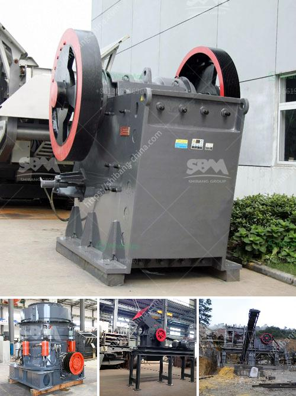

<h3>ball mill in egypt</h3>
A ball mill is a type of grinder used to grind, blend, and sometimes for mixing of materials for use in mineral dressing processes, paints, pyrotechnics, ceramics, and selective laser sintering. It works on the principle of impact and attrition: size reduction is done by impact as the balls drop from near the top of the shell. A ball mill consists of a hollow cylindrical shell rotating about its axis. The axis of the shell may be either horizontal or at a small angle to the horizontal. It is partially filled with balls. The grinding media are the balls, which may be made of steel, stainless steel, ceramic, or rubber.

The ball mill is a key piece of equipment for grinding crushed materials, and it is widely used in production lines for powders such as cement, silicates, refractory material, fertilizer, glass ceramics, etc., as well as for ore dressing of ferrous and non-ferrous metals. The ball mill can grind ores and other materials, wet or dry.

In Egypt, ball mills are taken as a critical part in the processing of marble powder. They are commonly used in the production of cement, silicate products, new building materials, refractory materials, fertilizers, black and non-ferrous metal mineral processing, glass ceramics and other production industries. Ball mill is suitable for grinding various ores and other materials. It is widely used in mineral processing, building materials and chemical industries. It can be divided into dry and wet grinding methods. According to different mining methods, it can be divided into lattice type and overflow type. At present, the ball mill machine is widely used in mine, cement, silicate products, building materials and other fields.

In conclusion, the ball mill has proved to be a versatile equipment in the cement industry, mineral processing industry, and other fields. Egypt is a country with a strong industrial base, and the ball mill is an indispensable grinding equipment for the production of cement. The article mainly introduces the ball mill in Egypt. Although the ball mill is a relatively wide-range grinding equipment, its role is still indispensable in the beneficiation production line.
<h3>Contact us</h3><ul><li><strong>Whatsapp:&nbsp;<a href="https://wa.me/8613661969651">+8613661969651</a></strong></li><li><a href="https://swt.shibang-china.com/?git&amp;zhl&amp;ball mill in egypt"><strong>Online Service(chat now)</strong></a></li></ul><h3>Related</h3><ul><li><a href='price of crusher sand in tons south africa.md'>price of crusher sand in tons south africa</a></li><li><a href='mobile crusher in sweden.md'>mobile crusher in sweden</a></li><li><a href='gypsum crusher specification.md'>gypsum crusher specification</a></li><li><a href='roll grinders manufacturers.md'>roll grinders manufacturers</a></li><li><a href='stone crushing machineries imphal.md'>stone crushing machineries imphal</a></li></ul>