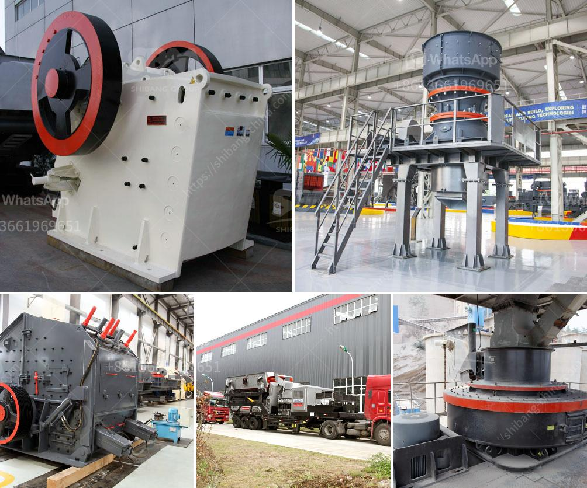

<h3>ball mill in kazakhstan</h3>
Kazakhstan, renowned for its rich mineral resources and large reserves of uranium, copper, and zinc, is considered one of the world's leading mining countries. With its vast deposits, the country has been attracting significant investments and global attention in the mining sector. Among the several essential equipment used in mineral resource processing, the ball mill stands out as a critical device for comminution and beneficiation processes.

A ball mill is widely utilized in many industries such as mining, cement, and pharmaceuticals. It involves a rotary cylinder, where particles are gradually reduced in size by impact and attrition. Comminution plays a vital role in various stages of mineral resource processing, including crushing, grinding, and refining. In Kazakhstan, the ball mill is exceptionally crucial due to the abundance of metal ores, especially copper and gold.

Copper Processing: The ball mill's versatility and efficiency make it essential for the production of copper ore, which often contains less than 1% copper. This low concentration is a significant challenge for the metallurgical industry. Additionally, high-grade copper ores have become scarce, compelling mining companies to extract lower-grade deposits. The ball mill's ability to grind and separate copper-bearing minerals from gangue materials contributes to optimizing the cost-effective extraction process.

Gold Refining: Kazakhstan is also a significant producer of gold, with reserves estimated at over eleven million ounces. The ball mill is essential in the gold refining process as it breaks down the gold-bearing ore, speeding up the precious metal extraction. The process is further enhanced by gravity concentration techniques that utilize the force of water to separate gold particles from other minerals, helping increase overall yield and refining efficiency.

Mining operations, including ball milling processes, often face environmental challenges due to water and energy consumption, as well as the release of large quantities of fine particles and chemicals. In Kazakhstan, where environmental regulations are becoming increasingly stringent, mining companies are focusing on sustainable practices. For example, modern ball mills are equipped with advanced technology that minimizes the consumption of water and energy while optimizing the grinding performance.

Furthermore, the implementation of efficient dust collection and filtration systems helps reduce the release of fine particles into the atmosphere. Additionally, Kazakhstan is exploring ways to utilize renewable energy sources, such as solar and wind, to power mining operations, thus reducing their environmental footprint.

As Kazakhstan continues to drive sustainable economic growth through its mineral resource processing sector, the ball mill stands out as a key equipment in various mining operations. Its ability to efficiently reduce particle size and aid in the extraction and refining processes of essential materials like copper and gold makes it integral to Kazakhstan's mining industry. While environmental challenges exist, the industry is continually embracing innovative technologies and shifting towards sustainable practices, ensuring both resource optimization and ecological impact minimization.

In conclusion, the ball mill plays a crucial role in the development of Kazakhstan's mining industry, contributing to the country's economic prosperity while adhering to environmental regulations and sustainable practices.
<h3>Contact us</h3><ul><li><strong>Whatsapp:&nbsp;<a href="https://wa.me/8613661969651">+8613661969651</a></strong></li><li><a href="https://swt.shibang-china.com/?git&amp;zhl&amp;ball mill in kazakhstan"><strong>Online Service(chat now)</strong></a></li></ul><h3>Related</h3><ul><li><a href='crusher jaw crusher 10 36.md'>crusher jaw crusher 10 36</a></li><li><a href='providers conveyor belts in mexico.md'>providers conveyor belts in mexico</a></li><li><a href='micro crushers plant.md'>micro crushers plant</a></li><li><a href='400 tph mobile coal crusher plant manufacturer.md'>400 tph mobile coal crusher plant manufacturer</a></li><li><a href='basalt crusher price in senegal.md'>basalt crusher price in senegal</a></li></ul>