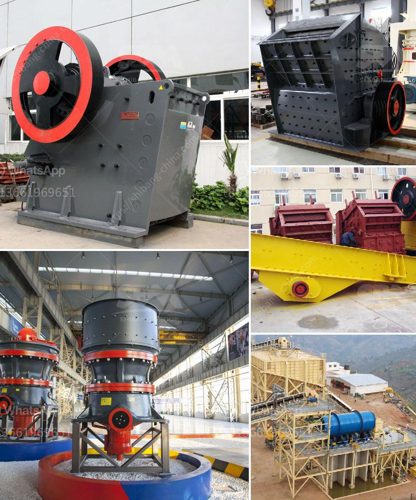

<h3>ball mill inside</h3>
The ball mill is a cylindrical drum (or cylindrical conical) turning around its horizontal axis. It is partially filled with grinding bodies: cast iron or steel balls, or even flint (silica) or porcelain bearings. Spaces between balls or bearings are occupied by the load to be milled.

Following drum rotation, balls or bearings rise by rolling along the cylindrical wall and descending again in a cascade or cataract motion. In a regular cycle, the cascading motion crushes the ore into finer particles. As the ball mill rotates, the balls or bearings also rotate along the inner wall of the drum, creating additional crushing forces.

In terms of grinding bodies, the ball mill operates at a much higher efficiency compared to other mills such as rod or pebble mills. However, concerns about the impact of abrasive balls or bearings on the mill shell must be addressed. Grinding bodies should be made of a material harder than the ore being milled to ensure minimal wear of the drum. Otherwise, the debris from worn-out balls or bearings might contaminate the finished product.

Inside the ball mill, various compartments exist for different grinding stages. The main shell, housing the drum, consists of an almost seamless cylindrical tube. The lining of the shell comprises either rubber or steel plates, depending on the application. These liners protect the shell from excessive wear and facilitate efficient ball or bearing movement.

Efficient ball mills utilize a variety of energy-saving devices such as energy-efficient motor drives, high-pressure grinding rolls, and advanced process control systems. These systems reduce energy consumption, heat generation, and overall wear, ultimately increasing the ball mill's lifespan and decreasing its environmental impact.

Overall, ball mills are widely used in the mineral processing industry due to their flexibility, efficiency, and reliability. They are suitable for both wet and dry grinding operations and can process a wide range of materials. With continuous advancements in technology, ball mills are becoming more efficient, sustainable, and environmentally friendly, ensuring their significance in the industrial milling process for years to come.
<h3>Contact us</h3><ul><li><strong>Whatsapp:&nbsp;<a href="https://wa.me/8613661969651">+8613661969651</a></strong></li><li><a href="https://swt.shibang-china.com/?git&amp;zhl&amp;ball mill inside"><strong>Online Service(chat now)</strong></a></li></ul><h3>Related</h3><ul><li><a href='beneficiation of iron ore in dry methods.md'>beneficiation of iron ore in dry methods</a></li><li><a href='grinder mill in malaysia.md'>grinder mill in malaysia</a></li><li><a href='marble milling machine for sale.md'>marble milling machine for sale</a></li><li><a href='stone crushers for sale in riyadh.md'>stone crushers for sale in riyadh</a></li><li><a href='chart of accounts for cement factory.md'>chart of accounts for cement factory</a></li></ul>