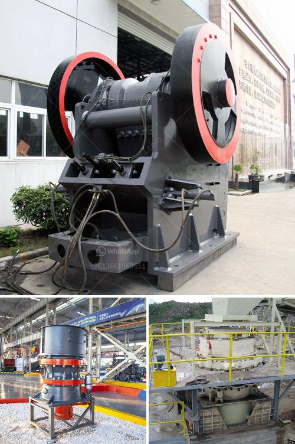

<h3>ball mill made in usa</h3>
The milling process has been an integral part of various industries for centuries. From grinding grain to creating pigments for paints and dyes, ball mills have been revolutionizing the way substances are processed, providing outstanding performance and reliable results. This article explores the history and influence of ball mills made in USA, highlighting their key advantages and impact in the industrial sector.

The concept of the ball mill originated from the early 20th century. In 1890, Knelson invented the gravity concentration technique, which primarily utilizes the force of gravity for separation. In the 1920s, the United States and Germany had developed a roller race mill, steel ball mill, tube mill, and rod mill. These mills became the foundation for the extensive use of ball mills today.

Today, this process of grinding solid materials using a ball mill is widely appreciated in the industry. The innovative design of both, the mills and the grinding jars, allows for continuous grinding down to the nano range in the shortest amount of time - with only minor warming effects. Furthermore, ball mills are relatively simple machines with minimal moving parts, simplifying operation and maintenance.

One of the crucial advantages of an efficient ball mill is its ability to perform dry or wet grinding operations, which can result in a higher overall grinding efficiency. Another influential factor is its extremely high grinding intensity, as it utilizes centrifugal forces for mixing and grinding substances. This intensity saves time and energy, ensuring optimal productivity for diverse industries.

The versatility of a ball mill lies in its extensive applications, including the grinding of raw materials in cement manufacturing, paint, glass, ceramics, and pharmaceuticals. Additionally, ball mills can be used for refining chemicals, producing coatings, polishing rocks, and even making black powder for recreational purposes.

Ball mills made in the USA provide superior quality and safety standards to ensure smooth operations. Their reliability allows companies to produce quality products, establishing their credibility among consumers and stakeholders. With stringent safety regulations in place, the U.S.-manufactured ball mills undergo rigorous testing and regular inspections to ensure compliance.

The manufacturing of ball mills within the United States significantly contributes to the economy. By supporting the domestic ball mill industry, the nation experiences growth, job creation, and the preservation of valuable technical expertise. It also reduces the dependence on imported machinery, promoting self-sustainability, and reinforcing local industries.

The ball mill made in USA has played a significant role in the advancement of grinding technologies, revolutionizing industries such as cement, paint, ceramics, and pharmaceuticals. Furthermore, the mill's efficiency and versatility have also provided value to the manufacturing sector, enhancing the overall economic growth of the country. With its superior quality and safety standards, the U.S.-manufactured ball mill remains a top choice for industrial operations, ensuring reliable performance and consistent results.
<h3>Contact us</h3><ul><li><strong>Whatsapp:&nbsp;<a href="https://wa.me/8613661969651">+8613661969651</a></strong></li><li><a href="https://swt.shibang-china.com/?git&amp;zhl&amp;ball mill made in usa"><strong>Online Service(chat now)</strong></a></li></ul><h3>Related</h3><ul><li><a href='gypsum powder dryer price pakistan.md'>gypsum powder dryer price pakistan</a></li><li><a href='starting a quarry business in nigeria.md'>starting a quarry business in nigeria</a></li><li><a href='kobe crushers singapore suppliers.md'>kobe crushers singapore suppliers</a></li><li><a href='second hand crushers and screens in south africa.md'>second hand crushers and screens in south africa</a></li><li><a href='mobile crusher hire kenya.md'>mobile crusher hire kenya</a></li></ul>