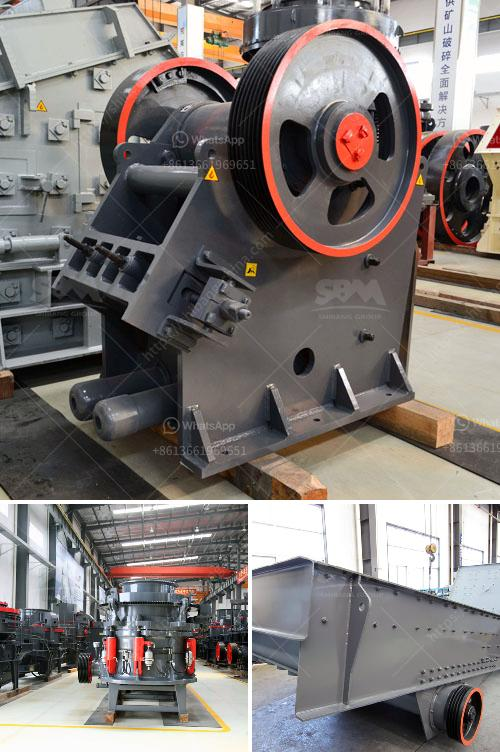

<h3>ball mill magnetic separator</h3>
The ball mill magnetic separator is a high-efficiency separation equipment that is used in the dense medium separation process. It is widely used in metallurgy, mining, coal, electric power, building materials, and other industries.

This paper will introduce the principle of the magnetic separator in the ball mill, the structure of the magnetic separator, and the advantages and benefits of using it.

The main principle of the magnetic separator in the ball mill is that the magnetic minerals are magnetically chosen and then the non-magnetic minerals are removed. This process is mainly carried out in two stages: crushing and grinding. First, the ore is crushed to a certain size by a crusher, and then it is sent to the ball mill for grinding. During the grinding process, the ore is ground to a certain size, and the useful minerals are released from the gangue minerals. Then, under the action of the magnetic field, the magnetic minerals are adsorbed on the surface of the magnetic separator, and the non-magnetic minerals are discharged from the discharge port. This process not only improves the grade of the ore but also reduces the amount of gangue in the concentrate, thus increasing the economic benefits for the enterprise.

The ball mill magnetic separator is composed of a cylindrical rotating device, an overflow weir, and a magnetic separator. The ore from the discharge port of the ball mill enters the rotating device, which is driven by a motor to rotate. The ore falls into the cylinder and is crushed by the impact and grinding of the grinding medium. The crushed ore is then classified by the overflow weir and separated into different particle sizes. The magnetic separator is placed in the bottom of the cylinder and the magnetic particles are adsorbed on the surface of the magnetic separator, forming a magnetic concentrate.

The ball mill magnetic separator has several advantages over other magnetic separators. Firstly, the magnetic separator has a large processing capacity, which can handle a large amount of ore in a short time. Secondly, the magnetic separator has a high magnetic field strength, which can effectively separate magnetic minerals from non-magnetic minerals. Thirdly, the magnetic separator has a simple structure and is easy to operate and maintain. It does not require any additional power supply, reducing the production cost for enterprises.

In conclusion, the ball mill magnetic separator is an efficient separation equipment that can be used in various industries. It has the advantages of high processing capacity, strong magnetic field strength, and simple structure. It plays an important role in improving the economic benefits of enterprises and should be widely used in the future.
<h3>Contact us</h3><ul><li><strong>Whatsapp:&nbsp;<a href="https://wa.me/8613661969651">+8613661969651</a></strong></li><li><a href="https://swt.shibang-china.com/?git&amp;zhl&amp;ball mill magnetic separator"><strong>Online Service(chat now)</strong></a></li></ul><h3>Related</h3><ul><li><a href='price of hammer mill in china.md'>price of hammer mill in china</a></li><li><a href='germany stone crushing plants.md'>germany stone crushing plants</a></li><li><a href='stone crusher supplier in tanzania.md'>stone crusher supplier in tanzania</a></li><li><a href='price of crusher sand in tons south africa.md'>price of crusher sand in tons south africa</a></li><li><a href='hammer mill dimensions.md'>hammer mill dimensions</a></li></ul>