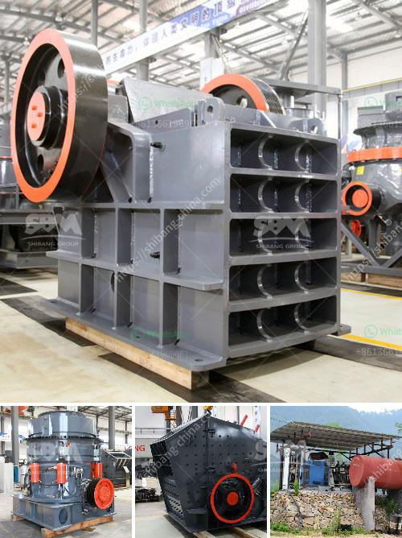

<h3>ball mill manufacturers in gujarat</h3>
Gujarat is one of the fastest growing industrial states in India. It is home to several industries including textiles, agro-based products, chemicals, and pharmaceuticals. This rapid industrialization has led to the increasing demand for various types of machinery, including ball mills.

A ball mill is a grinding machine used to grind and blend materials for use in various industries such as cement, ceramics, chemicals, and construction. It consists of a hollow cylinder shell rotating about its axis and partially filled with balls. The grinding media is the balls which may be made of steel, stainless steel, ceramic, or rubber.

Ball mills can be used for grinding materials in two ways: dry grinding and wet grinding. It is ideal for grinding hard materials, such as cement clinker and limestone, where the efficiency of the mill can be greatly improved by adding a small amount of water.

Gujarat has a thriving ball mill manufacturing industry. Many ball mill manufacturers are already established in the state to cater to the growing demand for this equipment. These manufacturers offer high-quality ball mills that are extensively used in various industrial sectors.

Ball mill manufacturers in Gujarat have in-house R&D facilities that provide technical solutions to address the specific requirements of customers. They specialize in producing customized ball mills of various capacities and specifications to meet the needs of different industries.

1. Shiv Shakti Enterprise: Established in 1993, Shiv Shakti Enterprise is a leading manufacturer of ball mill in Gujarat. They manufacture a variety of ball mills with different capacities and sizes to meet the requirements of various industrial sectors.

2. Technomart India: Technomart India is a prominent ball mill manufacturer in Gujarat. They manufacture a wide range of ball mills, including continuous ball mill, batch type ball mill, and ceramic ball mill. Technomart India is also known as a leader in providing innovative designs and quality products for mineral industries.

3. Shree Balaji Engineering: Shree Balaji Engineering is a leading manufacturer and supplier of ball mill in Gujarat. They manufacture high-quality ball mills with different capacities, ensuring superior performance and impeccable quality.

4. Jyoti Innovision Pvt. Ltd.: Established in 2005, Jyoti Innovision Pvt. Ltd. is a leading manufacturer and supplier of ball mill in Gujarat. They specialize in producing wear-resistant linings, such as alumina ceramic lining, rubber lining, and high alumina ceramic balls for grinding.

5. Vira Engineering: Vira Engineering is a prominent manufacturer and supplier of ball mill in Gujarat. They offer a wide range of ball mills with different capacities and specifications to meet the diverse needs of various industries.

In conclusion, Gujarat has a thriving ball mill manufacturing industry that caters to the growing demand for high-quality ball mills. These manufacturers specialize in producing customized ball mills that are widely used in various sectors, such as cement, ceramics, chemicals, and construction. With their in-house R&D facilities, they provide technical solutions to meet the specific requirements of customers. Gujarat's ball mill manufacturers are known for their quality products, innovative design solutions, and excellent customer service.
<h3>Contact us</h3><ul><li><strong>Whatsapp:&nbsp;<a href="https://wa.me/8613661969651">+8613661969651</a></strong></li><li><a href="https://swt.shibang-china.com/?git&amp;zhl&amp;ball mill manufacturers in gujarat"><strong>Online Service(chat now)</strong></a></li></ul><h3>Related</h3><ul><li><a href='list of stone crusher plant in bangladesh.md'>list of stone crusher plant in bangladesh</a></li><li><a href='jaw crusher price in nigeria.md'>jaw crusher price in nigeria</a></li><li><a href='quarry plant equipments and costs.md'>quarry plant equipments and costs</a></li><li><a href='applied geochemistry for mica processing.md'>applied geochemistry for mica processing</a></li><li><a href='crusher machines suppliers in south africa.md'>crusher machines suppliers in south africa</a></li></ul>