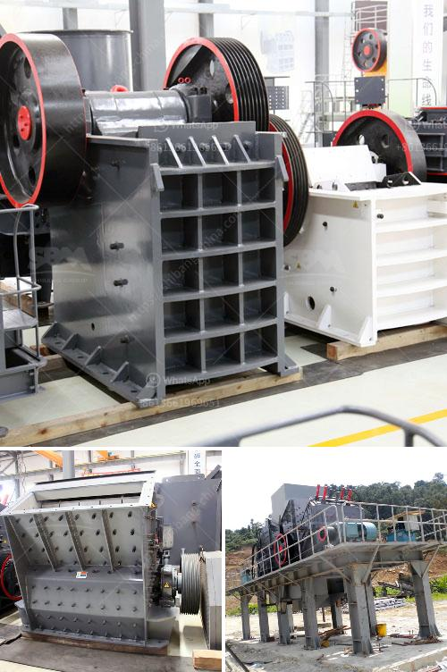

<h3>ball mill operation cost</h3>
Ball mill operation is often regarded as something of a mystery for many individuals. However, in reality, ball mill operation is not as complex as it seems, and Ball mill operation cost is relatively low.

Ball mill operation cost around 50% to 75% of their critical speed, ball mills are generally used to grind material 1/4 inch and finer, down to the particle size of 20 to 75 microns. To achieve a reasonable efficiency with ball mills, they must be operated in a closed system, with oversize material continuously being recirculated back into the mill to be reduced.

Various classifiers, such as screens, spiral classifiers, cyclones, and air classifiers are used for classifying the discharge from ball mills. Ball mill operation is also believed to be environmentally friendly since it reduces the dangers associated with waste disposal. The Ball mill operation cost is also low because of its low energy consumption.

With a long years of experience, we have gathered valuable information from hundreds of successful projects and our team is consistently developing new projects to improve our customer's bottom lines. Our team of experts is always ready to provide the most cost-effective and energy-efficient ball mill solutions for our clients' grinding needs.

We undertake ball mill supply, erection, and commissioning as per clients' requirements. We, not only provide ball mills, but also offer customization service and spare parts supply. Our team also ensures that clients receive a highly reliable and efficient ball mill operation cost solution that fits into the specific needs of their application.

To summarize, ball mill operation cost is relatively low, and it can provide a high return on investment for homeowners. Ball mill operation can also reduce material quality because it ensures that there is no oversize material to be rejected in the mill. Applying Ball mill operation cost savings to your operating budget allows you to reallocate funds to different areas of your business. However, in order to reap these cost benefits, you must optimize your ball mill operation cost.
<h3>Contact us</h3><ul><li><strong>Whatsapp:&nbsp;<a href="https://wa.me/8613661969651">+8613661969651</a></strong></li><li><a href="https://swt.shibang-china.com/?git&amp;zhl&amp;ball mill operation cost"><strong>Online Service(chat now)</strong></a></li></ul><h3>Related</h3><ul><li><a href='how to set up a quarry plant.md'>how to set up a quarry plant</a></li><li><a href='what is the cost of crusher.md'>what is the cost of crusher</a></li><li><a href='small jaw crusher for sale south africa.md'>small jaw crusher for sale south africa</a></li><li><a href='cost of cement clinker grinding unit.md'>cost of cement clinker grinding unit</a></li><li><a href='feldspar stone processing plant.md'>feldspar stone processing plant</a></li></ul>