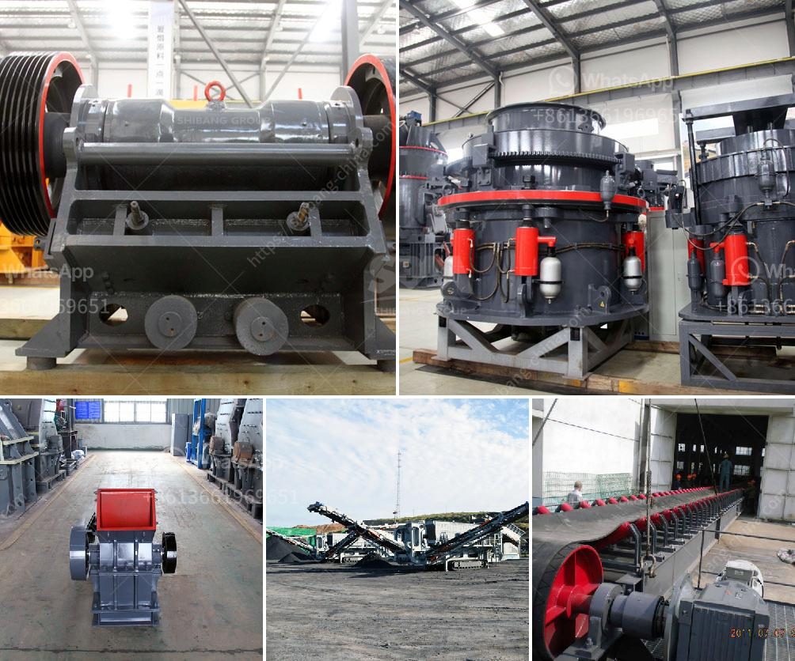

<h3>ball mill quartz lining suppliers</h3>
Ball Mill Quartz Lining Suppliers: The Importance of the Right Partnership for Efficient Mill Operation

Ball mills are pivotal equipment for pulverizing materials in various industries, including mining, cement, ceramics, and paint production. Grinding balls inside the mill generate strong impact and grinding forces to break down the material into smaller pieces. To ensure efficient mill operation, liners are used to protect the mill shell from wear and minimize energy consumption.

Quartz lining suppliers play a crucial role in providing high-quality lining materials for ball mills. The lining material not only protects the mill shell from abrasion but also improves the efficiency of the mill by reducing power consumption. A proper selection of lining materials is essential to ensure optimum grinding performance and longevity of the mill.

One of the key aspects to consider when choosing a quartz lining supplier is the material's quality. High-quality linings made of quartz offer excellent resistance to wear, chemicals, and temperature variations, providing long-lasting performance. Suppliers that adhere to strict quality control measures and offer certified linings can be trusted for their reliability and consistent product performance.

In addition to quality, availability and delivery time should also be taken into account. Reliable suppliers should have sufficient stock to meet the demands of their customers promptly. They should have a well-established network for timely delivery, ensuring uninterrupted mill operation.

Cost-effectiveness is another crucial consideration when selecting a quartz lining supplier. While it's tempting to opt for the cheapest option, it's essential to prioritize quality and longevity over immediate cost savings. Long-lasting and efficient linings might have a slightly higher purchase price, but they can significantly reduce downtime and increase productivity in the long run.

Furthermore, suppliers with good after-sales support can provide valuable assistance when it comes to installation, maintenance, and troubleshooting. They should be readily available to address any concerns or queries and provide technical support when required.

In conclusion, choosing the right quartz lining supplier is paramount for efficient ball mill operation. A reliable supplier that offers high-quality, readily available linings, at cost-effective prices, and provides excellent after-sales support is the key to ensuring optimal mill performance, minimizing downtime, and maximizing productivity. Investing in a trusted partnership with the right supplier will yield significant benefits for any business dependent on ball mills for their grinding processes.
<h3>Contact us</h3><ul><li><strong>Whatsapp:&nbsp;<a href="https://wa.me/8613661969651">+8613661969651</a></strong></li><li><a href="https://swt.shibang-china.com/?git&amp;zhl&amp;ball mill quartz lining suppliers"><strong>Online Service(chat now)</strong></a></li></ul><h3>Related</h3><ul><li><a href='60ton ball mill nigeria.md'>60ton ball mill nigeria</a></li><li><a href='costs for a stone crusher plant.md'>costs for a stone crusher plant</a></li><li><a href='stone crusher rubber conveyor.md'>stone crusher rubber conveyor</a></li><li><a href='diatomite processing plant.md'>diatomite processing plant</a></li><li><a href='stone mill grinder appliances made in china.md'>stone mill grinder appliances made in china</a></li></ul>