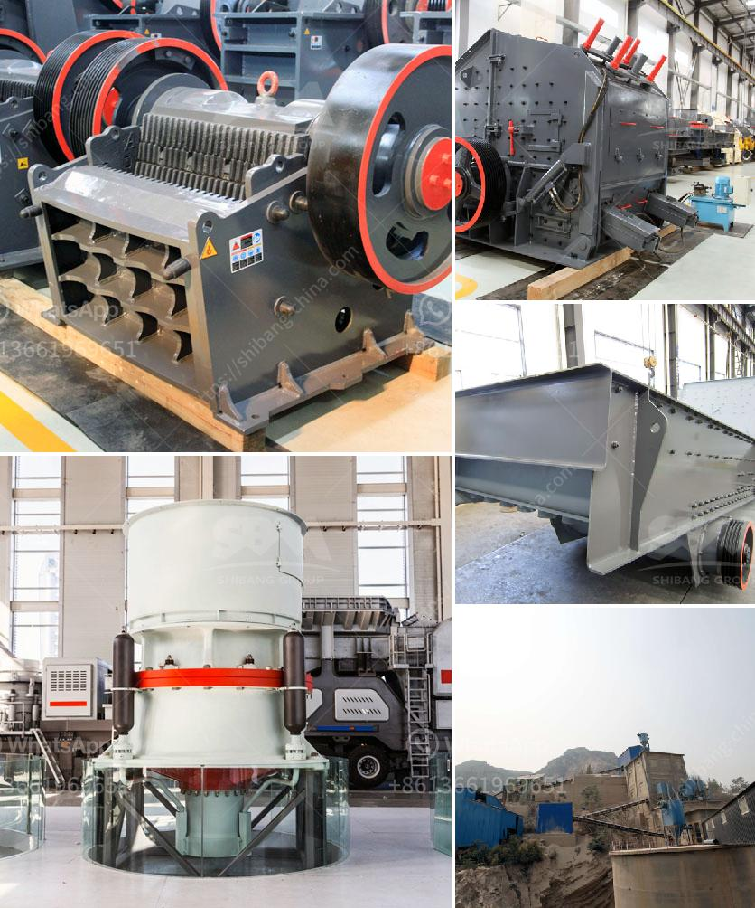

<h3>ball mill spares manufacturers in india</h3>
India is a vibrant country that has a rich heritage and history of producing a wide range of industrial machinery, equipment, and spare parts. Ball mill spares manufacturers in India are a key part of the mining machinery and for any mining industry. Mining machinery is necessary for the efficient operation of a mining operation, and their availability is essential for the smooth running of the industry.

Ball mill spares manufacturers in India have the capability to produce various types of machines and spare parts, to ensure that the grinding process runs smoothly and efficiently. They manufacture a range of machines and spare parts of ball mills to meet the demands of different industries, such as mining, cement, ceramics, and many more.

The ball mills are widely used in the mining industry, cement industry, and other industries to grind all kinds of ores and materials. They are highly efficient grinding machines, capable of grinding material into fine powder. The ball mills are also used for mixing and blending purposes in various industries.

To meet the growing demands of the mining industry for efficient and reliable equipment, the ball mill spares manufacturers in India are constantly innovating and improving their products. They invest significantly in research and development to come up with new and innovative designs that enhance the performance of the ball mills.

The ball mill spares manufacturers in India have a team of engineers who constantly strive to improve the quality of their products. They use advanced manufacturing techniques and state-of-the-art machinery to produce high-quality spare parts for ball mills. The spare parts undergo rigorous quality checks to ensure that they meet the industry standards and specifications.

The ball mill spares manufacturers in India also cater to the demands of the mining industry. They design and manufacture a comprehensive range of mining equipment and spare parts, such as grinding media, mill liners, crushers, conveyor systems, and high-pressure grinding rolls.

The ball mill spares manufacturers in India use high-quality raw materials, sourced from the most reliable suppliers in the industry. They also undertake stringent quality control measures to ensure that every product leaving their premises is of the highest quality.

In addition to producing standard spare parts for ball mills, the manufacturers also offer customization services. They understand that different industries have different requirements, and hence, they manufacture customized spare parts to meet the specific needs of their clients.

The ball mill spares manufacturers in India have a well-established distribution network and after-sales services. They have dealers and agents spread across different parts of the country who ensure prompt delivery of spare parts and provide technical support whenever required.

In conclusion, the ball mill spares manufacturers in India are an integral part of the mining industry, as they produce high-quality spare parts that ensure the efficient and smooth running of grinding processes. They understand the importance of reliable equipment and spare parts in the mining industry and are constantly innovating to meet the changing demands of the industry. With their expertise and commitment to quality, the ball mill spares manufacturers in India are poised to play a crucial role in the growth and development of the mining industry in India.
<h3>Contact us</h3><ul><li><strong>Whatsapp:&nbsp;<a href="https://wa.me/8613661969651">+8613661969651</a></strong></li><li><a href="https://swt.shibang-china.com/?git&amp;zhl&amp;ball mill spares manufacturers in india"><strong>Online Service(chat now)</strong></a></li></ul><h3>Related</h3><ul><li><a href='ballast crusher machine price.md'>ballast crusher machine price</a></li><li><a href='ultra fine grinding mill.md'>ultra fine grinding mill</a></li><li><a href='stone crusher machine from uk.md'>stone crusher machine from uk</a></li><li><a href='jaw crusher price philippines.md'>jaw crusher price philippines</a></li><li><a href='100 tph stone crusher.md'>100 tph stone crusher</a></li></ul>