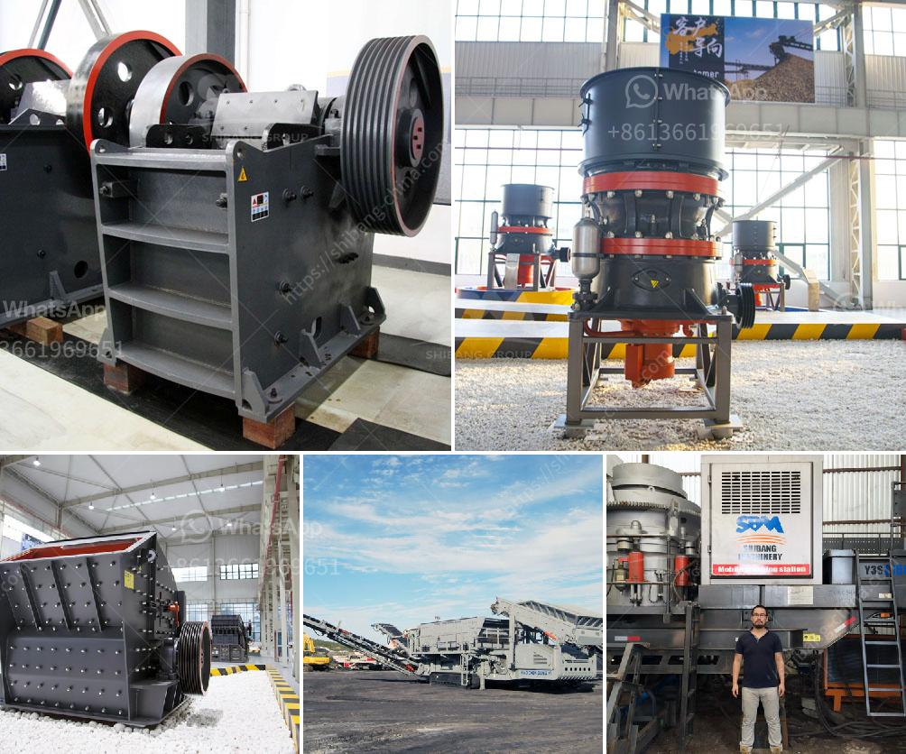

<h3>ball mill suppliers in south africa</h3>
Ball mill is crucial equipment for grinding after materials are crushed. It is an efficient tool for grinding various materials into powder. There are two ways of grinding: the dry process and the wet process. It can be divided into tabular type and flowing type according to different forms of discharging material. In general, Ball Mill name is easy to remember and it is very popular in the market. It is an ideal equipment that integrates crushing, drying, grinding and grading conveyor all together.

Ball mill suppliers in South Africa mainly provide ball mill for sale used for limestone, gypsum, cement clinker. They have been in the business for more than 30 years and export their products internationally, including South Africa, USA, Australia, Ghana, Russia, Canada, Egypt, UZ, Nubian, Peru, Indonesia, Brazil, Kenya, Papua New Guinea, Zambia, Oman, Zimbabwe, Mexico, Ghana, Zimbabwe, Philippines, Guinea, Argentina, etc.

Ball mill suppliers in South Africa have strong competitiveness, but in the actual production process, if users want to pass the test of market because of high production efficiency, low wear resistance, frequent maintenance, and other factors, it will inevitably be restricted by various factors and hesitate. Each problem is nothing more than cost, technology, and operation.

In terms of cost, ball mill suppliers in South Africa provide customers with stable performance, convenient maintenance and costs, low investment, and high return on investment. We are committed to ball mill design, mining machinery manufacturing, and running service. Our ball mills are widely used in metallurgy, chemical engineering, building materials, coal industries, ore grinding and many other sectors.

As our consumers' requirement, we will offer the high-quality ball mill suppliers in South Africa with competitive price. They will de their best to help you choose the most suitable one and provide you with excellent service. Please feel free to contact us for more information.

In terms of technology, ball mill suppliers in South Africa, with the development of market demand for mining machinery, manufacturing technology requirements are getting higher and higher, especially in the downstream industries such as cement clinker. Ball mill suppliers in South Africa face a great pressure need to improve technological level continuously. Meanwhile, ball mill suppliers in South Africa also development the model is gradually increased.

Recently, some enterprises have learned to find ways to stretch the chain in engineering technology transformation by expanding the product chain to meet the demands of the market. It is reported that this year, South Africa's mining machinery enterprises have set up a small production line of high-end grinding balls to meet the domestic high-end demand, which provides a new way to the "going out" of enterprises in South Africa.

Overall, ball mill suppliers in South Africa remain committed to expanding their existing product lines, improving technological innovation, optimizing product quality, and improving customer satisfaction. They strive to maintain their leading position in the industry and contribute to the sustainable development of South Africa.
<h3>Contact us</h3><ul><li><strong>Whatsapp:&nbsp;<a href="https://wa.me/8613661969651">+8613661969651</a></strong></li><li><a href="https://swt.shibang-china.com/?git&amp;zhl&amp;ball mill suppliers in south africa"><strong>Online Service(chat now)</strong></a></li></ul><h3>Related</h3><ul><li><a href='stone crushers for sale in uk.md'>stone crushers for sale in uk</a></li><li><a href='quarry crusher plant location in malaysia.md'>quarry crusher plant location in malaysia</a></li><li><a href='jaw crusher 0 5 t 1ton per hour.md'>jaw crusher 0 5 t 1ton per hour</a></li><li><a href='cost of building a recycling plant in india.md'>cost of building a recycling plant in india</a></li><li><a href='hp 400 cone crusher.md'>hp 400 cone crusher</a></li></ul>