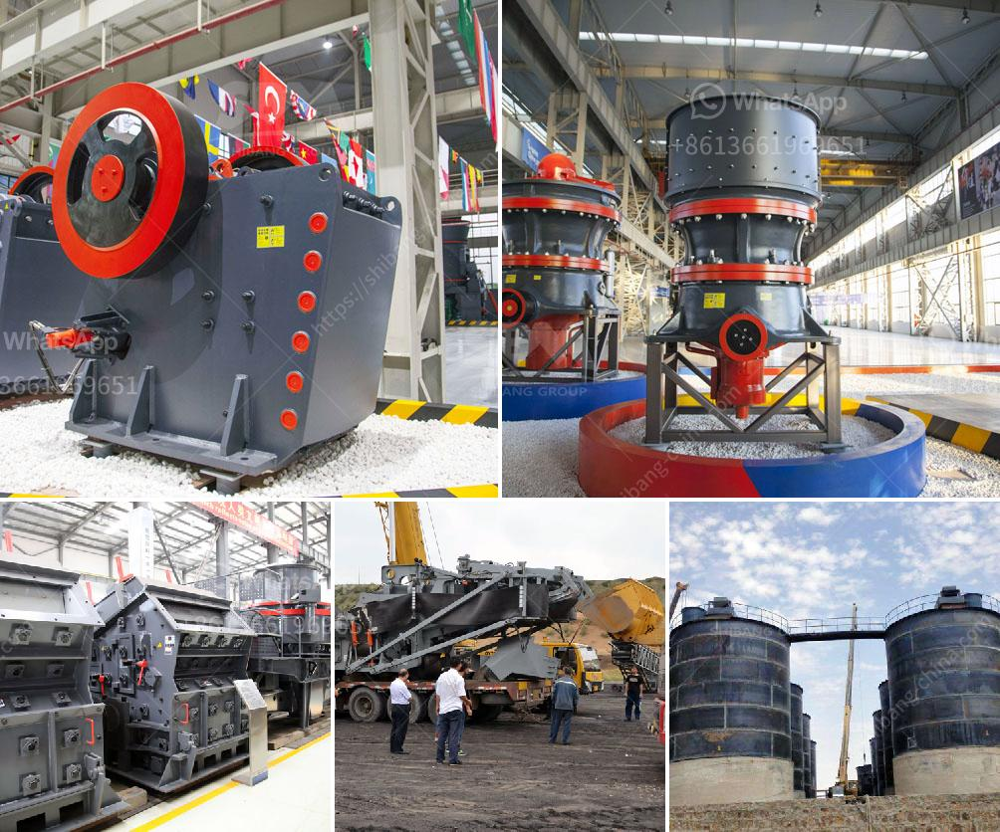

<h3>ball mill suppliers uk</h3>
The UK stands as an industrial hub for various sectors, including mining, construction, and pharmaceuticals. These industries rely heavily on efficient machinery for achieving high productivity and quality results. One such essential equipment for material grinding is a ball mill. In the UK, several reputable suppliers cater to the diverse needs of these industries, offering reliable ball mills that enhance the overall efficiency of the grinding process.

Ball mills are mechanical devices that grind materials into fine powders, facilitating various industrial applications. Their primary function is to crush and grind solid and hard materials into smaller particles. Whether it is mining, cement production, or pharmaceutical manufacturing, ball mills are widely used to process various materials for different purposes.

Finding the right supplier is crucial when it comes to ball mills. Quality and reliability are paramount when choosing a supplier, as inefficient or substandard equipment can negatively impact production and incur additional costs. Fortunately, in the UK, there are several reputable ball mill suppliers that meet the industry's demand for top-notch products.

One such well-established supplier in the UK is [Supplier Name]. With years of expertise in the field, they have built a strong reputation for delivering high-quality ball mills designed to cater to diverse grinding needs. Their comprehensive range of ball mills includes both horizontal and vertical mills, allowing their clients to choose the most suitable option based on their specific requirements.

The ball mills provided by [Supplier Name] are manufactured using durable materials and cutting-edge technology, ensuring their longevity and efficiency. These mills come equipped with robust internal mechanisms that enable smooth and consistent operations, even under demanding conditions. Additionally, the suppliers offer customization options, allowing clients to tailor the ball mills to their exact specifications.

Another notable supplier in the UK market is [Supplier Name]. They are known for their innovative approach to ball mill design and manufacturing. [Supplier Name] focuses on providing energy-efficient solutions that not only enhance grinding performance but also reduce overall operational costs. Their highly skilled engineers work closely with clients to understand their unique requirements, resulting in bespoke ball mill solutions engineered to perfection.

Both [Supplier Name] and [Supplier Name] prioritize customer satisfaction, offering exceptional after-sales services and technical support. Their teams of experienced professionals are readily available to address any queries or concerns that might arise during the installation and operation process. This ensures a seamless experience for the clients, enabling them to maximize the potential of their ball mills and optimize production efficiency.

In conclusion, ball mill suppliers in the UK play a vital role in fulfilling the grinding needs of various industries. Their high-quality and reliable equipment contribute to achieving efficient and cost-effective material processing. Companies such as [Supplier Name] and [Supplier Name] have established themselves as reputable suppliers, offering top-notch ball mills that are tailored to meet the unique requirements of their clients. With their expertise and commitment to customer satisfaction, these suppliers continue to play a significant role in driving industrial growth in the UK.
<h3>Contact us</h3><ul><li><strong>Whatsapp:&nbsp;<a href="https://wa.me/8613661969651">+8613661969651</a></strong></li><li><a href="https://swt.shibang-china.com/?git&amp;zhl&amp;ball mill suppliers uk"><strong>Online Service(chat now)</strong></a></li></ul><h3>Related</h3><ul><li><a href='broach grinding machine manufacture in china.md'>broach grinding machine manufacture in china</a></li><li><a href='cost of stone crusher plant in saudi.md'>cost of stone crusher plant in saudi</a></li><li><a href='quarry crusher plant location in malaysia.md'>quarry crusher plant location in malaysia</a></li><li><a href='jaw crusher for sale in kenya.md'>jaw crusher for sale in kenya</a></li><li><a href='plant project report pdf stone crushing.md'>plant project report pdf stone crushing</a></li></ul>