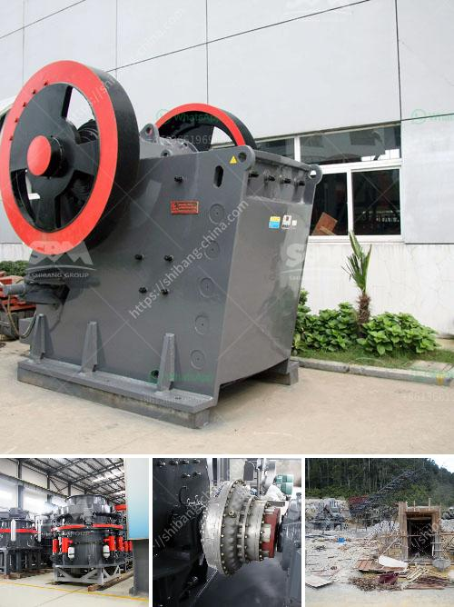

<h3>ball mill suppliers</h3>
In the mining industry, ball mill is widely used as a common machine. In many stone processing plants, it is very common as well for processing stones into powder size. Ball mill is one of the most important parts in the whole mining process, thus its production efficiency and precision are vital. Ball mill suppliers must be chosen carefully to ensure that the machine will be suitable for the material and industry requirements.

When it comes to selecting ball mill suppliers, there are a few factors to consider. Firstly, it is important to choose suppliers that have a good reputation in the market. Reputable suppliers are more likely to provide high-quality products and excellent customer service. They have the necessary experience and expertise to offer reliable solutions to various needs.

It is also essential to choose suppliers that offer a wide range of ball mill options. Different materials and industries require different types of ball mills. A trustworthy supplier should be able to provide a variety of options to fit diverse needs. This ensures that customers can find the most suitable ball mill for their specific applications.

Reliable suppliers should also provide excellent after-sales support. A ball mill is a complex and expensive machine, and it may require maintenance or repair from time to time. Suppliers who offer reliable after-sales support can provide technical assistance and spare parts promptly. This helps minimize downtime and ensures the continuous operation of the ball mill, saving both time and money for the customer.

Lastly, it is crucial to consider the pricing of the ball mill suppliers. Prices can vary significantly from one supplier to another, and it is important to strike a balance between quality and affordability. Choosing a supplier that offers competitive prices while maintaining excellent quality is crucial for maximizing the value of the investment.

In conclusion, selecting the right ball mill suppliers is essential for the efficiency and precision of the mining process. Reputable suppliers, a wide range of options, excellent after-sales support, and competitive pricing are key factors to consider when choosing suppliers for this machinery. Investing time and effort in finding reliable suppliers is crucial for the success of any mining project.
<h3>Contact us</h3><ul><li><strong>Whatsapp:&nbsp;<a href="https://wa.me/8613661969651">+8613661969651</a></strong></li><li><a href="https://swt.shibang-china.com/?git&amp;zhl&amp;ball mill suppliers"><strong>Online Service(chat now)</strong></a></li></ul><h3>Related</h3><ul><li><a href='iron crushing equipment for sale.md'>iron crushing equipment for sale</a></li><li><a href='feldspar stone processing plant.md'>feldspar stone processing plant</a></li><li><a href='dry wash prospecting unit for sale western philippines.md'>dry wash prospecting unit for sale western philippines</a></li><li><a href='ghana quarry crusher.md'>ghana quarry crusher</a></li><li><a href='stone crusher user manual.md'>stone crusher user manual</a></li></ul>