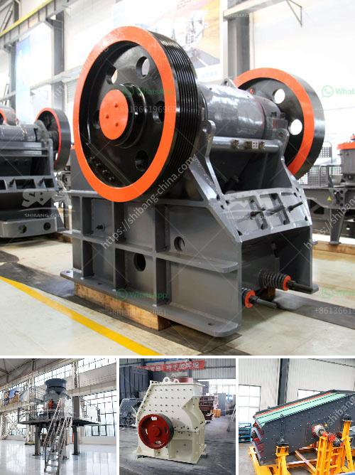

<h3>ball milling in chemistry</h3>
Ball milling is a technique used in the field of chemistry to grind and mix materials into fine powder. It has a wide range of applications, including cement, pharmaceuticals, cosmetics, food, and many more. In recent years, this technique has gained immense popularity due to its ability to produce nanocrystalline powders and materials with enhanced properties.

The process of ball milling involves the usage of a hollow cylindrical container that rotates on its axis, which contains balls of different sizes. The material to be ground is placed inside the container along with the balls, and as the container rotates, the balls cascade and crush the material into a fine powder. The size reduction occurs due to the impact and collision between the balls and the material. Furthermore, the continuous rotation of the container ensures a homogeneous mixing of the powders.

One of the significant advantages of ball milling is its versatility. It allows for the grinding and mixing of a wide variety of materials, ranging from soft to hard, brittle to ductile, and even fibrous materials. This technique is also capable of producing powders with different particle sizes, from micron-scale to nanoscale. The control over particle size is crucial as it directly impacts the final properties and performance of the material.

The high-energy ball milling technique is a specific form of ball milling that utilizes higher energy inputs to facilitate the particle size reduction process. It produces nanocrystalline powders with enhanced properties compared to conventional ball milling. This is achieved by using larger and denser grinding media that impact the material with higher energy, resulting in a more efficient size reduction process. Moreover, the high-energy ball milling technique can induce structural changes in the material, leading to improved properties such as increased hardness, strength, and chemical reactivity.

In addition to particle size reduction, ball milling can also be used for material synthesis. It provides a convenient method for the formation of new compounds or alloys by mixing the constituent elements or powders together during the milling process. This technique is particularly useful for obtaining solid-state materials that are difficult to synthesize using conventional methods. The mechanical forces and high-energy impacts generated during ball milling facilitate the exchange and diffusion of atoms, leading to the formation of new compounds.

The ball milling technique is not without limitations. The process is time-consuming and requires a substantial amount of energy input. It also generates heat, and therefore, temperature control inside the milling container is crucial to avoid undesired thermal effects. Furthermore, the choice of grinding media, ball-to-powder ratio, and milling time must be optimized to achieve the desired properties and ensure a successful outcome.

In conclusion, ball milling is a powerful and versatile technique in the field of chemistry that is utilized for grinding, mixing, and even material synthesis. It enables the production of nanocrystalline powders and materials with enhanced properties. Despite its limitations, the benefits of ball milling make it a valuable tool for researchers and scientists in various industries.
<h3>Contact us</h3><ul><li><strong>Whatsapp:&nbsp;<a href="https://wa.me/8613661969651">+8613661969651</a></strong></li><li><a href="https://swt.shibang-china.com/?git&amp;zhl&amp;ball milling in chemistry"><strong>Online Service(chat now)</strong></a></li></ul><h3>Related</h3><ul><li><a href='quartz powder buyers 300 mesh.md'>quartz powder buyers 300 mesh</a></li><li><a href='stone crusher machine price in kenya.md'>stone crusher machine price in kenya</a></li><li><a href='crushing service with peru jaw crusher.md'>crushing service with peru jaw crusher</a></li><li><a href='business plan for sand making machine.md'>business plan for sand making machine</a></li><li><a href='italy stone crusher manufacter.md'>italy stone crusher manufacter</a></li></ul>