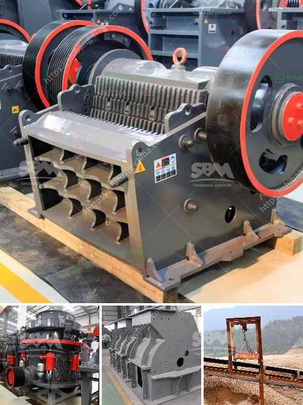

<h3>ball mills for calcium</h3>
Ball mills are a common grinding equipment in the mining industry, which is mainly used to grind various minerals and other materials into fine powder. Calcium is a common mineral, abundant in nature, and its uses can be traced back to ancient times. In the modern era, calcium carbonate has become one of the most commonly used materials in various industries due to its diverse properties and wide range of applications.

Ball mills for calcium are machines designed for grinding calcium carbonate into fine powder. Calcium carbonate is a commonly used filler, which is obtained through the grinding of natural carbonate minerals such as calcite, marble, and limestone. It can be used as a raw material in the construction, chemical, and food industries, among others.

The operation of ball mills for calcium involves various variables, including the speed of rotation, the size and quantity of grinding media, as well as the efficiency of the grinding media. Besides, the shape and material of the lining and the ball mill chamber also have an impact on the grinding efficiency. Typically, ball mills are operated under dry conditions, but wet grinding of calcium carbonate is also possible.

One of the key advantages of ball mills for calcium is their efficiency. They can produce narrow particle size distribution and achieve high production yields within a short period. Additionally, these mills are versatile and can handle both wet and dry grinding. The adjustable speed of rotation further enables personalized control over the grinding process.

The process of grinding calcium carbonate in ball mills involves crushing of particles to reduce their size, followed by classification into different grades based on particle size. For instance, fine calcium carbonate powder with a precise particle size distribution can be obtained through multi-stage grinding. This ensures the suitability of the powder for various industrial processes.

In addition to the aforementioned advantages, ball mills for calcium are also cost-effective. They are widely available in the market and are relatively easy to operate and maintain. The robustness of their construction allows for long-term use without significant wear and tear. Consequently, they are an ideal choice for companies seeking to optimize their production processes and improve overall efficiency.

Furthermore, ball mills for calcium offer environmental benefits. Natural calcium carbonate reserves are abundant, and its extraction and grinding have a limited environmental impact compared to other minerals. Additionally, the use of calcium carbonate as a filler in various industries helps reduce the dependence on non-renewable resources, leading to a more sustainable manufacturing process.

In conclusion, ball mills for calcium are an essential grinding tool in the mining industry and have applications in various sectors. Their ability to produce fine powder, high efficiency, versatility, and cost-effectiveness make them a preferred choice for many companies. Furthermore, the environmental benefits associated with calcium carbonate usage contribute to the overall sustainability of industrial processes. As technology advances, further improvements can be expected in terms of efficiency and cost-effectiveness, making ball mills for calcium an even more attractive option for manufacturers.
<h3>Contact us</h3><ul><li><strong>Whatsapp:&nbsp;<a href="https://wa.me/8613661969651">+8613661969651</a></strong></li><li><a href="https://swt.shibang-china.com/?git&amp;zhl&amp;ball mills for calcium"><strong>Online Service(chat now)</strong></a></li></ul><h3>Related</h3><ul><li><a href='limestone powder making machine.md'>limestone powder making machine</a></li><li><a href='provider of conveyor belts for mining.md'>provider of conveyor belts for mining</a></li><li><a href='harare changfa diesel engine.md'>harare changfa diesel engine</a></li><li><a href='new crushing machine in south africa.md'>new crushing machine in south africa</a></li><li><a href='asphalt crushing machine capacity 15 ton hour.md'>asphalt crushing machine capacity 15 ton hour</a></li></ul>