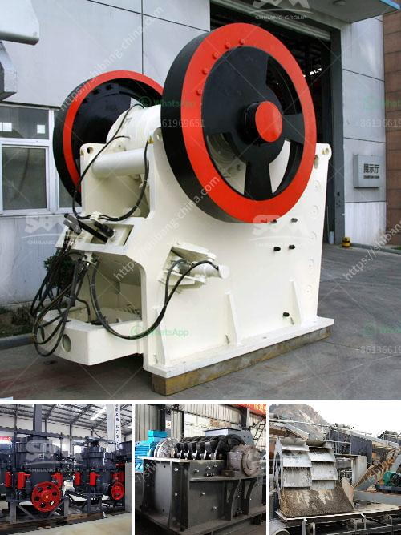

<h3>ball mills for grinding</h3>
Ball mills are commonly used for crushing and grinding materials into fine powders. They are also used in the manufacturing process of paints, pigments, cement, silicates, fertilizers, glass, ceramics, and many more. The ball mill consists of a cylindrical shell that rotates on a horizontal axis, which is partially filled with a grinding medium such as balls.

The material to be ground is loaded into the shell, and as the cylinder rotates, the grinding media collide with the material, causing it to break into smaller pieces. The continuous cascading action generated by the rotating cylinder ensures efficient grinding of the material.

The size of the grinding medium, the speed of rotation, and the duration of milling greatly influence the final particle size and the quality of the end product. The grinding medium can be made of steel, ceramic, or rubber, depending on the application. It is important to choose the appropriate grinding medium to avoid contamination and achieve the desired particle size.

One advantage of ball mills is their versatility, as they can perform both dry and wet grinding. Dry grinding is preferred for materials that can withstand higher temperatures, while wet grinding is suitable for materials that are more sensitive to heat and humidity. Some common applications include particle size reduction, dispersing pigments in paints, and grinding clinker in cement production.

Ball mills are also energy-efficient, with low operating costs compared to other grinding methods. The reduced energy consumption and lower maintenance requirements make them an attractive option for many industries. Additionally, ball mills offer a relatively simple and reliable operation, making them suitable for both small-scale and large-scale operations.

In conclusion, ball mills are essential equipment for grinding and crushing various materials into fine powders. They are widely used in various industries and offer several advantages such as versatility, energy efficiency, and low operating costs. Whether it's for grinding ores, ceramics, or chemicals, ball mills provide an efficient solution for particle size reduction.
<h3>Contact us</h3><ul><li><strong>Whatsapp:&nbsp;<a href="https://wa.me/8613661969651">+8613661969651</a></strong></li><li><a href="https://swt.shibang-china.com/?git&amp;zhl&amp;ball mills for grinding"><strong>Online Service(chat now)</strong></a></li></ul><h3>Related</h3><ul><li><a href='coal crusher size 100 tph.md'>coal crusher size 100 tph</a></li><li><a href='list of stone crusher equipment.md'>list of stone crusher equipment</a></li><li><a href='ball mill for mineral grinding india.md'>ball mill for mineral grinding india</a></li><li><a href='quartz making machine germany.md'>quartz making machine germany</a></li><li><a href='gold mining industry in tanzania.md'>gold mining industry in tanzania</a></li></ul>