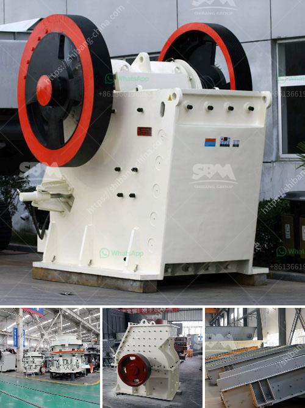

<h3>ball mills for mica powder</h3>
Ball mills are a type of grinder used to grind and blend materials for use in various industries, such as mineral processing, cosmetics, ceramics, and paint. They are often used in combination with other machinery, such as agitated media mills and jet mills, to achieve fine particle sizes and narrow particle size distributions.

One specific application of ball mills is in the production of mica powder, a finely ground mineral used in various applications, including cosmetics, paint, and rubber. Mica powder is made by grinding mica flakes, which is a slow, costly, and extremely labor-intensive process. The use of ball mills for grinding mica particles is an ideal solution, as they can easily grind down mica flakes to the desired particle size, giving a smooth and homogeneous product.

Ball mills for mica powder are characterized by their simple structure, easy maintenance, and high grinding efficiency. These mills are designed to grind and mix materials of diverse hardness and abrasiveness. They consist of a cylindrical shell rotating around its axis, inside which the grinding media - typically steel balls - are placed. When the mill is rotated, the grinding media crush the mica flakes into fine powder through impact and attrition forces. The rotation speed and size of the balls can be adjusted to optimize the grinding process and achieve the desired particle size distribution.

In addition to their grinding capabilities, ball mills for mica powder offer other advantages. They are energy-efficient and have a low environmental impact, making them a sustainable option. Furthermore, these mills are versatile and can be used for both wet and dry grinding. This flexibility allows for the production of mica powder with different characteristics, depending on the application requirements.

In conclusion, ball mills are a valuable tool in the production of mica powder. Their ability to grind mica flakes into fine powder, high grinding efficiency, and versatility make them an ideal choice for various industries. With advancements in technology, ball mills continue to play a crucial role in the manufacturing process of mica powder, contributing to its wide range of applications.
<h3>Contact us</h3><ul><li><strong>Whatsapp:&nbsp;<a href="https://wa.me/8613661969651">+8613661969651</a></strong></li><li><a href="https://swt.shibang-china.com/?git&amp;zhl&amp;ball mills for mica powder"><strong>Online Service(chat now)</strong></a></li></ul><h3>Related</h3><ul><li><a href='price of grinding machine.md'>price of grinding machine</a></li><li><a href='stone crusher manufacturers in ranchi.md'>stone crusher manufacturers in ranchi</a></li><li><a href='gold mining equipments manufacturers.md'>gold mining equipments manufacturers</a></li><li><a href='philippines rock and granite quarries.md'>philippines rock and granite quarries</a></li><li><a href='artificial sand making in karnataka.md'>artificial sand making in karnataka</a></li></ul>