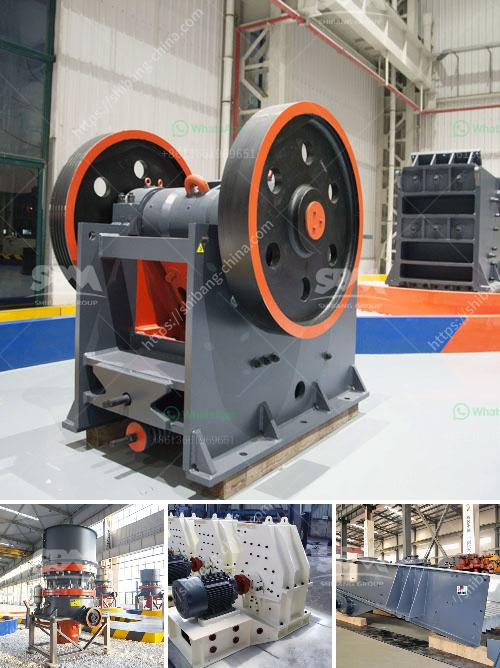

<h3>ball mills in lima</h3>
Ball mills are a type of grinders used to grind and blend materials for use in mineral dressing processes, paints, pyrotechnics, ceramics, and selective laser sintering. They are widely used in the mining industry, where they are essential in the metallic and non-metallic ore processing operations.

In Lima, the bustling capital of Peru, ball mills play a significant role in the mining and construction industries. Lima, being one of the leading mining destinations in South America, relies heavily on these mills to process ore extracted from the surrounding mountains.

One of the primary uses of ball mills is in the extraction of precious metals, such as gold and silver. Miners in Lima extract ore-rich rocks from mines and grind them down into fine particles using ball mills. The finely ground ore is then processed using various techniques, including cyanide leaching, to separate the desired metals from the ore. Ball mills, with their precise grinding capabilities, are crucial in ensuring the ore particles are finely ground for efficient extraction.

Furthermore, ball mills are also used in the construction industry in Lima. These versatile machines are essential in producing cement, a crucial component in various construction projects. The process of producing cement involves grinding clinker, a mixture of raw materials, in a ball mill. The grinding action of the rotating mill helps produce the fine powder necessary for making cement. Lima, with its growing urbanization and infrastructure development, relies heavily on ball mills to meet the increasing demand for cement.

The efficiency and reliability of ball mills have made them indispensable in the mining and construction industries in Lima. These machines are designed to withstand the harsh conditions of continuous operation, extracting and grinding massive amounts of ore and materials.

However, it is important to note that the use of ball mills also raises certain environmental concerns. The energy-intensive operation of these mills contributes to carbon emissions and climate change. Efforts are being made in Lima, and globally, to improve the energy efficiency of ball mills through innovations in technology and the use of renewable energy sources.

In conclusion, ball mills play a crucial role in the mining and construction industries in Lima. These versatile machines are central in the extraction of precious metals and the production of cement. Their efficient grinding capabilities make them essential in ore processing and the creation of fine powder. While the usage of ball mills raises environmental concerns, efforts are being made to mitigate their impact. As Lima continues to grow and develop, ball mills will remain a fundamental part of its mining and construction sectors.
<h3>Contact us</h3><ul><li><strong>Whatsapp:&nbsp;<a href="https://wa.me/8613661969651">+8613661969651</a></strong></li><li><a href="https://swt.shibang-china.com/?git&amp;zhl&amp;ball mills in lima"><strong>Online Service(chat now)</strong></a></li></ul><h3>Related</h3><ul><li><a href='bauxite calcination plant cost in india.md'>bauxite calcination plant cost in india</a></li><li><a href='200mm crusher sieve opening sizes.md'>200mm crusher sieve opening sizes</a></li><li><a href='calcium carbonate plant manufacturers.md'>calcium carbonate plant manufacturers</a></li><li><a href='suppliers of ld slag crushing plants in india.md'>suppliers of ld slag crushing plants in india</a></li><li><a href='mini cement plant in pakistan.md'>mini cement plant in pakistan</a></li></ul>