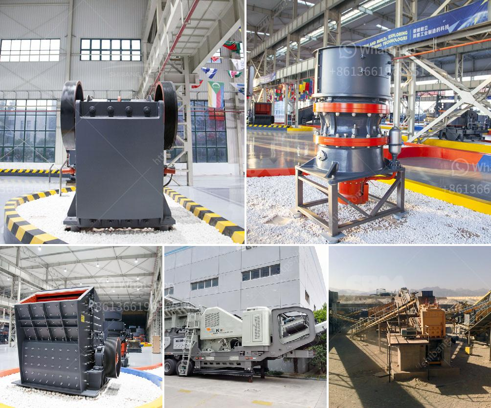

<h3>ballast crusher machine price</h3>
Ballast production involves many different stages such as excavation, stripping, drilling, blasting, primary crushing, secondary crushing, tertiary crushing, screening, sand making process etc. SBM is global supplier and manufacturer of crushing and processing machinery for quarry, construction and mining applications.

We developed comprehensive range of ballast crushing machinery with low investment cost, low energy consumption, reliable performance, less maintenance etc. If you are interested, please feel free to contact us for more information.

The ballast crusher machine price has the advantages of simple structure, easy manufacture, reliable work, convenient to repair and use. Production working principle of ballast crusher machine price. 1.The jaw rock crusher plant price adopts the electric motor as the power. 2.The eccentric shaft is revolved by an electric motor through v-belts. 3.They make the swing jaw to follow the preconcerted path to crush the material. 4.The crushing chamber is composed of the stationary jaw plate, swing jaw plate and the liner plate. 5.The material is discharged from the lower part of machine that is what you want.

Ballast crusher machine price can be used for hard limestone, granite, basalt, cobble, metallurgical slag of a variety of materials such as aggregate and making artificial sand homework, suitable for water and electricity, building material, highway, the application of the urban construction and other industries. According to different technical requirements, various types of ballast crusher equipment undertakes assorted, meet customer's different technological requirements.

Ballast crusher machine price is a new type of crusher designed by our company which is following the traditional jaw crusher. The bearing of ballast crusher machine price uses integral cast steel structure, which can ensure the reliability and durability of long-term use of equipment. In addition, lubrication system of it is safe and reliable, which boasts an easy and convenient maintenance. Simple structure, reliable work, low cost in operation.

Welcome to visit our website for more detailed information on the ballast crusher machine price. We sincerely look forward to cooperating with you.
<h3>Contact us</h3><ul><li><strong>Whatsapp:&nbsp;<a href="https://wa.me/8613661969651">+8613661969651</a></strong></li><li><a href="https://swt.shibang-china.com/?git&amp;zhl&amp;ballast crusher machine price"><strong>Online Service(chat now)</strong></a></li></ul><h3>Related</h3><ul><li><a href='product japan crushing plant.md'>product japan crushing plant</a></li><li><a href='crushing plant aggregate type.md'>crushing plant aggregate type</a></li><li><a href='copper leaching plants for sale.md'>copper leaching plants for sale</a></li><li><a href='stone grinding mills in pakistan.md'>stone grinding mills in pakistan</a></li><li><a href='vertical vertical grinding machine.md'>vertical vertical grinding machine</a></li></ul>