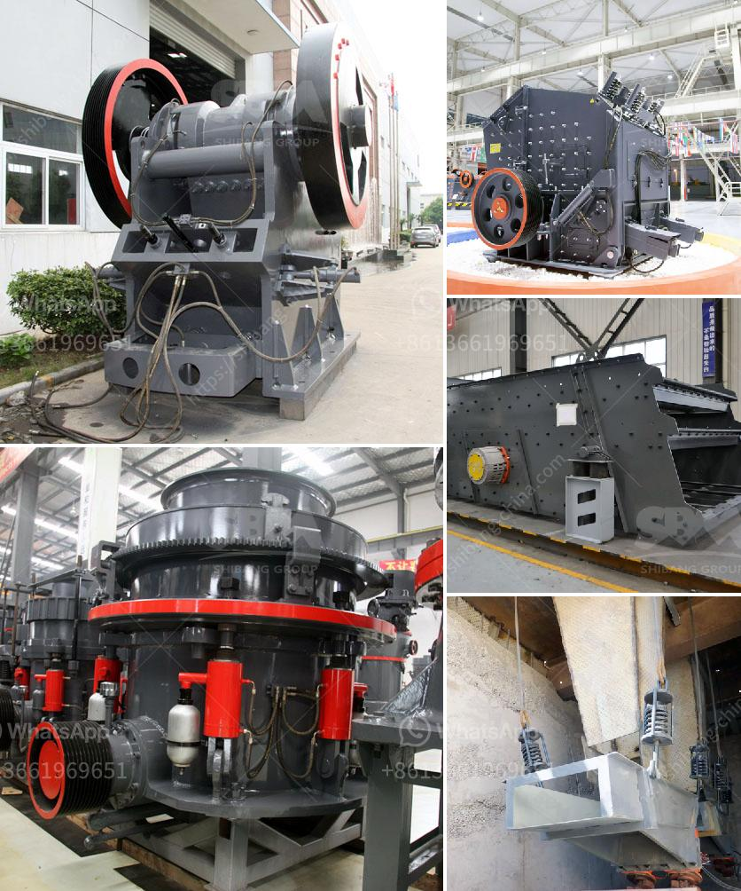

<h3>ballast crusher prices in kenya</h3>
A ballast crusher is primarily used for producing track ballast and other forms of railway ballast that are essential in the railway construction industry. However, a ballast crushing machine is not limited to producing track ballast alone; it can also break stones into ballast or sand. Compared to a fixed crusher, the ballast crushing machine is more flexible and can move independently, making it an ideal solution for owners of multiple construction projects or those who frequently move between sites.

In Kenya, there is a significant demand for ballast, primarily due to the ongoing construction projects in the country. Railways, roads, bridges, and other infrastructure projects require considerable amounts of ballast to ensure stability and safety. As a result, investing in a ballast crushing machine is a lucrative venture for many entrepreneurs.

When considering the cost of a ballast crushing machine, there are several factors to consider. Firstly, the type of machine greatly influences the price. Different types of crushers have different capacities, sizes, and capabilities. For example, jaw crushers are generally more expensive than impact crushers, but they tend to offer greater reduction ratios, making them suitable for larger-scale projects.

Another critical factor is the production capacity required for the project at hand. A machine with higher production capacity is usually pricier due to its ability to handle larger volumes of ballast. However, investing in a higher capacity machine might be a wise decision if there is a possibility of expanding the project in the future or if you have multiple ongoing projects.

Additionally, the brand and quality of the ballast crusher also influence its price. Top brands typically have higher price tags due to their reputation for producing durable and reliable machines. However, it is essential to strike a balance between the cost and quality to ensure that the machine can withstand the demands of the job.

It is also important to note that the price of a ballast crushing machine can vary depending on the supplier. While there are numerous suppliers in Kenya, it is advisable to compare prices from different vendors before making a purchase. This will help you find the best deal without compromising on the quality of the machine.

In conclusion, investing in a ballast crushing machine can be a profitable endeavor in Kenya's construction industry. The demand for ballast continues to grow, creating a lucrative market for entrepreneurs. However, before making a purchase, it is crucial to consider factors such as the type of machine, production capacity, brand, and supplier. Conducting thorough research and comparing prices will ensure that you get the best value for your investment. With a well-chosen ballast crusher, not only will you meet the demand for ballast in the market but also open up new opportunities for growth and success.
<h3>Contact us</h3><ul><li><strong>Whatsapp:&nbsp;<a href="https://wa.me/8613661969651">+8613661969651</a></strong></li><li><a href="https://swt.shibang-china.com/?git&amp;zhl&amp;ballast crusher prices in kenya"><strong>Online Service(chat now)</strong></a></li></ul><h3>Related</h3><ul><li><a href='shafts of a ball mill.md'>shafts of a ball mill</a></li><li><a href='mini jaw crusher saudi.md'>mini jaw crusher saudi</a></li><li><a href='used stone crusher on sale in jharkhand.md'>used stone crusher on sale in jharkhand</a></li><li><a href='gold mining wash plants for sale in ghana.md'>gold mining wash plants for sale in ghana</a></li><li><a href='mantencion a cone crusher.md'>mantencion a cone crusher</a></li></ul>