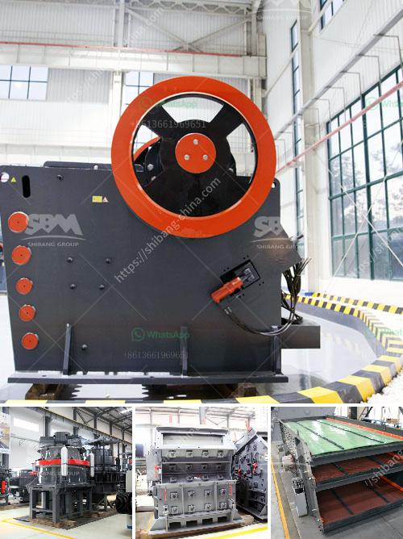

<h3>ballast processing</h3>
Ballast processing plays a vital role in enhancing the stability and safety of railway tracks. It involves the transformation of raw material into crushed stone, which is then used as a foundation base for railway tracks. The proper processing of ballast ensures that the tracks remain in top condition, reducing the risk of derailments and ensuring smooth and safe train operations.

The ballast, consisting of crushed stone, gravel, or other suitable materials, is placed beneath the railway tracks to provide support and stability. It helps distribute the load of passing trains evenly, preventing excessive settlement or movement of the track. Over time, the ballast can degrade and become contaminated with dust, dirt, and debris, compromising its ability to perform its function effectively.

Ballast processing starts with the removal of old and worn-out ballast. The existing track bed is excavated, and the old ballast material is carefully removed. This process uncovers any underlying issues such as degraded sub-ballast or track geometry problems. Addressing these issues is crucial to maintain the track's stability and safety.

Once the old ballast is removed, it undergoes a series of processing stages to produce the desired crushed stone. The processing usually involves crushing the material to specific particle sizes and cleaning it through a screening process. This ensures that the resulting ballast meets the required specifications, such as uniformity, hardness, and angularity.

Crushing the ballast material involves the use of heavy machinery, such as crushers and impactors. These machines break the large stones into smaller pieces, facilitating the screening process. The crushed ballast is then passed through various screens to separate it into different particle sizes. This step is critical as it helps eliminate fines and excess dust, ensuring a clean and uniform product.

Once the ballast material is processed and graded, it is ready to be reinstalled on the track bed. The new ballast is placed and compacted to create a stable and solid foundation for the railway tracks. Proper compaction ensures that the ballast does not shift or settle under the weight of passing trains, maintaining track geometry and preventing any potential hazards.

Ballast processing offers several benefits in improving railway track stability and safety. Firstly, the use of processed ballast helps distribute the load evenly, reducing the risk of track deformation and settlement. This prevents track irregularities, such as dips or bumps, that can lead to train derailments.

Secondly, processed ballast provides better drainage and protects the track from water-related issues. The removal of fines and dust during processing helps prevent clogging and enhances the ballast's ability to drain water. Adequate drainage is essential as it prevents water accumulation, which can weaken the trackbed and lead to track instability.

Moreover, properly processed ballast also improves train ride quality and reduces track maintenance requirements. The uniformity and hardness of the crushed stone provide a stable and smoother surface for trains to operate on. This reduces the wear and tear on the tracks, minimizing the need for frequent repairs and maintenance.

In conclusion, ballast processing is a crucial aspect of maintaining a safe and stable railway track infrastructure. By ensuring that the ballast material meets the required specifications, the track stability, and safety can be significantly enhanced. The process of removing, crushing, and screening the ballast ensures that the resulting material is clean, uniform, and capable of supporting the track's load efficiently. Investing in proper ballast processing not only improves train operations but also enhances passenger safety.
<h3>Contact us</h3><ul><li><strong>Whatsapp:&nbsp;<a href="https://wa.me/8613661969651">+8613661969651</a></strong></li><li><a href="https://swt.shibang-china.com/?git&amp;zhl&amp;ballast processing"><strong>Online Service(chat now)</strong></a></li></ul><h3>Related</h3><ul><li><a href='gold mining industry in tanzania.md'>gold mining industry in tanzania</a></li><li><a href='difference between horizontal milling machine.md'>difference between horizontal milling machine</a></li><li><a href='silica sand plant.md'>silica sand plant</a></li><li><a href='impact stone crusher.md'>impact stone crusher</a></li><li><a href='price of gypsum plant.md'>price of gypsum plant</a></li></ul>