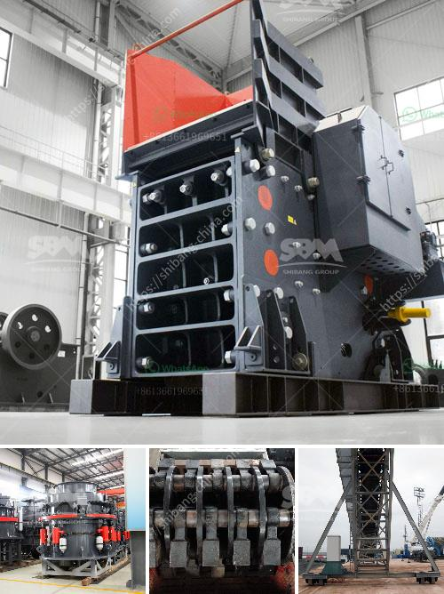

<h3>balls mill in uk</h3>
Tucked away in the picturesque English countryside lies the enchanting Balls Mill, a hidden gem that is often overlooked by tourists and locals alike. With its stunning natural beauty and rich historical significance, this quaint mill offers visitors a truly unique and immersive experience.

Located in the heart of the Cotswolds, Balls Mill sits on the banks of the charming River Windrush. Dating back to the 18th century, the mill was once a bustling hub of activity, where grain was ground into flour to supply the bustling surrounding villages. Although it no longer operates as a working mill, this historic structure serves as a testament to the region's rich industrial heritage.

One of the most captivating aspects of Balls Mill is its scenic surroundings. The mill is nestled amidst lush greenery, offering breathtaking views that are reminiscent of a scene from a fairytale. The peaceful sound of the flowing river and the gentle rustling of leaves create a tranquil atmosphere, making it an ideal spot for nature enthusiasts and those seeking a moment of respite.

Visitors to Balls Mill can explore the remnants of the mill's machinery and learn about the traditional milling process. The inner workings of the mill have been carefully preserved, allowing visitors to gain a deeper understanding of the arduous and intricate labor that was required to produce flour in days gone by.

For those seeking outdoor activities, Balls Mill provides ample opportunities for various recreational pursuits. The river adjacent to the mill offers excellent fishing spots, where anglers can try their luck at catching some of the local trout and salmon. The surrounding woodlands are also perfect for peaceful walks and picnics, allowing visitors to revel in the tranquility of nature.

Despite its relative anonymity, Balls Mill's intimate charm and captivating beauty make it a must-visit destination for those looking to immerse themselves in the UK's rich history and natural wonders. So, next time you find yourself in the Cotswolds, make sure to venture off the beaten path and discover the enchanting allure of Balls Mill - a hidden gem waiting to be explored.
<h3>Contact us</h3><ul><li><strong>Whatsapp:&nbsp;<a href="https://wa.me/8613661969651">+8613661969651</a></strong></li><li><a href="https://swt.shibang-china.com/?git&amp;zhl&amp;balls mill in uk"><strong>Online Service(chat now)</strong></a></li></ul><h3>Related</h3><ul><li><a href='granite processing machines china.md'>granite processing machines china</a></li><li><a href='process of granite mining crusher machines used.md'>process of granite mining crusher machines used</a></li><li><a href='vibrating screens manufacturers.md'>vibrating screens manufacturers</a></li><li><a href='stone rock crushers in oman for sale.md'>stone rock crushers in oman for sale</a></li><li><a href='sand washing machine in ethiopia.md'>sand washing machine in ethiopia</a></li></ul>