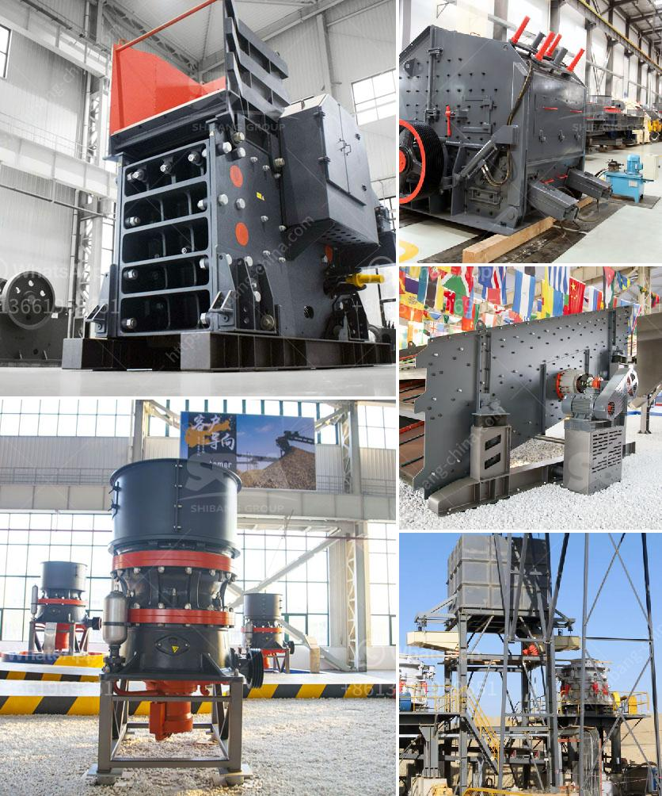

<h3>barangay resolution crushing plant</h3>
The issue of environmental protection has grown in significance in recent years, as our society becomes increasingly aware of the negative impacts of certain activities on our delicate ecosystems. In response, a barangay resolution has been passed to address the concerns surrounding the operation of a crushing plant within our community. This resolution aims to protect our environment, ensure the sustainability of our natural resources, and promote the overall well-being of our residents.

First and foremost, the barangay resolution acknowledges the potential environmental hazards that the operation of a crushing plant may pose. Crushing plants are known to emit dust and other pollutants during the process of crushing rocks into smaller particles. This can directly contaminate the air, water, and soil in the surrounding area, leading to severe health problems for residents and damage to local flora and fauna.

To mitigate these potential risks, the barangay resolution mandates strict control measures for the operation of the crushing plant. These measures emphasize the implementation of advanced dust control mechanisms, regular monitoring of air and water quality, and the establishment of effective waste management practices. By ensuring that the plant adheres to these guidelines, the resolution aims to minimize the negative impact on the environment and protect the health and well-being of our community.

Furthermore, the barangay resolution emphasizes the importance of public participation and transparency. It requires the crushing plant operators to conduct regular consultations with community members and stakeholders, providing them with an opportunity to voice their concerns and opinions. This ensures that the operation of the crushing plant takes into account the interests and welfare of the local population, promoting a sense of shared responsibility and inclusivity.

The resolution also highlights the need for continuous monitoring and evaluation of the crushing plant's environmental impact. Regular inspections will be conducted by the barangay and environmental agencies to assess compliance with the resolution's guidelines and to identify areas for improvement. By doing so, the resolution aims to ensure a proactive approach towards environmental protection, taking into account any changes or advancements in technology that can further minimize the plant's impact on the environment.

Overall, the barangay resolution on the operation of a crushing plant demonstrates a strong commitment to environmental sustainability and the welfare of our community. It recognizes the potential risks associated with such an operation and establishes strict control measures to mitigate these risks. By promoting public participation, transparency, and continuous monitoring, the resolution ensures that the operation of the crushing plant aligns with the best practices for environmental protection.

It is crucial for all residents to understand and support the implementation of this resolution. Each of us has a role to play in protecting our environment and promoting a sustainable future. By actively participating in consultations, reporting any concerns, and holding the crushing plant operators accountable, we can contribute to the well-being of our community and the preservation of our natural resources for future generations.
<h3>Contact us</h3><ul><li><strong>Whatsapp:&nbsp;<a href="https://wa.me/8613661969651">+8613661969651</a></strong></li><li><a href="https://swt.shibang-china.com/?git&amp;zhl&amp;barangay resolution crushing plant"><strong>Online Service(chat now)</strong></a></li></ul><h3>Related</h3><ul><li><a href='granite cone crusher.md'>granite cone crusher</a></li><li><a href='quartz ball mill machinery.md'>quartz ball mill machinery</a></li><li><a href='mobile stone crushers in usa.md'>mobile stone crushers in usa</a></li><li><a href='silica sand production line in german.md'>silica sand production line in german</a></li><li><a href='second hand crushing and screening plant sale.md'>second hand crushing and screening plant sale</a></li></ul>