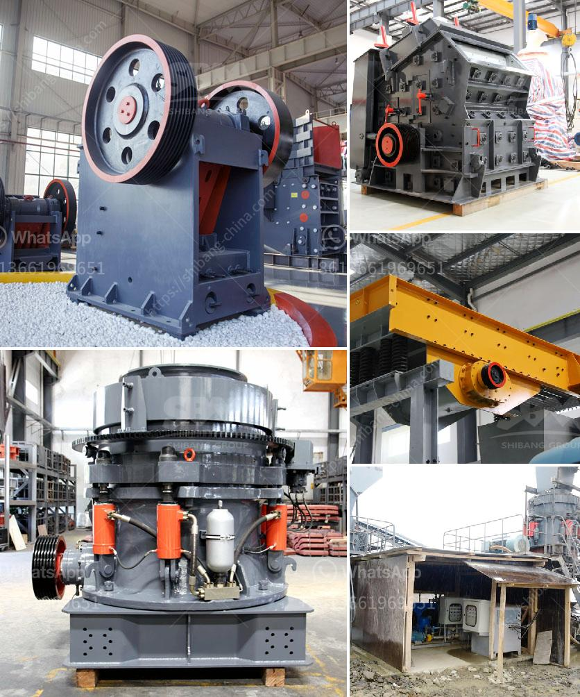

<h3>barite and bentonite mining companies</h3>
Barite (barium sulfate) and bentonite (sodium bentonite) are vital resources in the drilling industry. These minerals are used in a variety of applications including drilling fluids, drilling muds, and cementing. With the increasing demand for energy and drilling activities worldwide, the need for barite and bentonite is also on the rise.

Several mining companies specialize in extracting and refining these minerals. These companies play a crucial role in the drilling industry by ensuring a steady supply of high-quality barite and bentonite. Let's explore some of the prominent mining companies that dominate this industry.

One of the leading players in barite mining is Intercontinental Mining. This company operates the longest barite mine in the United States and has a significant presence in the oil and gas industry. Intercontinental Mining extracts barite from its rich deposits in Nevada, enhancing its reputation as a reliable supplier.

Another notable player in this sector is Black Hills Bentonite. With over 80 years of experience in the mining industry, Black Hills Bentonite has established itself as one of the top producers of sodium bentonite. The company's mining operations are located in Wyoming, South Dakota, and Montana, providing a sustainable supply of bentonite to customers worldwide.

These mining companies leverage their expertise and state-of-the-art technologies to extract these minerals efficiently. They follow strict quality control measures to ensure that the barite and bentonite they produce meet the industry standards. This commitment to quality has earned them an excellent reputation among their customers.

Barite and bentonite mining companies collaborate closely with drilling operators to optimize the performance of these minerals in drilling fluids. By sharing their technical expertise, they help the industry overcome drilling challenges, improve operational efficiency, and address environmental concerns.

As the energy sector continues to expand, the demand for barite and bentonite is expected to soar. Mining companies are well-positioned to meet this demand by investing in advanced exploration techniques and expanding their production capacities. By doing so, they ensure a stable supply of barite and bentonite for the drilling industry.

In conclusion, barite and bentonite mining companies play a vital role in the drilling industry's success. Their dedication to quality and continuous improvement establishes them as reliable partners for drilling operators worldwide. With their expertise and commitment, these companies contribute to the sustainable growth of the energy and drilling sectors, paving the way for a solid partnership in the future.
<h3>Contact us</h3><ul><li><strong>Whatsapp:&nbsp;<a href="https://wa.me/8613661969651">+8613661969651</a></strong></li><li><a href="https://swt.shibang-china.com/?git&amp;zhl&amp;barite and bentonite mining companies"><strong>Online Service(chat now)</strong></a></li></ul><h3>Related</h3><ul><li><a href='malaysia hammer mills.md'>malaysia hammer mills</a></li><li><a href='cost of stone crusher plant in saudi.md'>cost of stone crusher plant in saudi</a></li><li><a href='mini crusher for sale in ireland.md'>mini crusher for sale in ireland</a></li><li><a href='stone processing equipment turkey company.md'>stone processing equipment turkey company</a></li><li><a href='used stone crushing plant for sale in germany.md'>used stone crushing plant for sale in germany</a></li></ul>