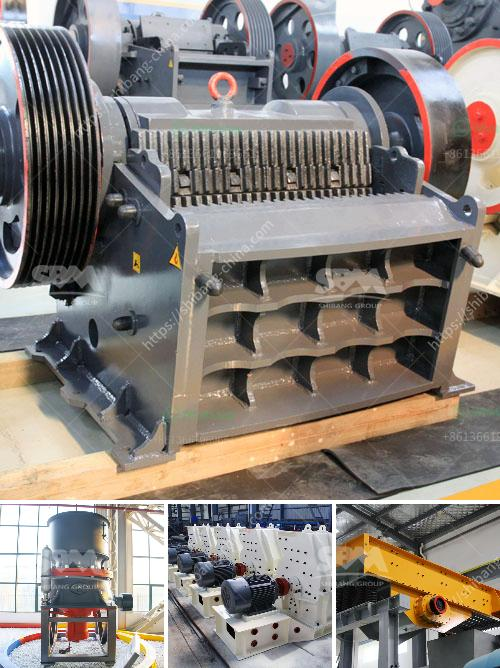

<h3>barite powder mill in india</h3>
Barite is a mineral found in abundance in the earth's crust. It is highly sought after for its use in various industries such as oil and gas, paint and coating, and pharmaceuticals. In recent years, India has emerged as a major player in the global barite market, and the demand for barite powder mill in India is on the rise.

India is home to vast reserves of barite, which are primarily found in the states of Andhra Pradesh, Rajasthan, and Gujarat. These reserves are estimated to be over 4 million metric tons. India's barite production currently stands at around 1.6 million metric tons per year, making it one of the largest producers of barite in the world.

The barite powder mill in India has a strong market potential. Barite powder is used as a weighting agent in drilling fluids in oil and gas exploration, and it plays a crucial role in the extraction of petroleum. Barite also finds application in paint and coating production, where it increases the durability and brightness of the coating. Furthermore, barite is used as a filler in various plastic and rubber products, as well as in pharmaceuticals for its medical properties.

The market for barite powder mill in India is driven by several factors. Firstly, the growing oil and gas exploration activities in the country are creating a significant demand for barite powder. India's energy needs are increasing rapidly, and with the government's focus on reducing dependence on imported oil, domestic oil exploration is on the rise.

Secondly, the paint and coating industry in India is experiencing robust growth due to increased infrastructure development and urbanization. Barite powder is a key ingredient in high-performance paint and coating formulations, which are in high demand in the construction and automotive sectors.

Additionally, the pharmaceutical sector in India is expanding rapidly, driven by a growing population and increasing healthcare expenditure. Barite powder is used in the production of barium sulfate, which has medical applications such as X-rays and other diagnostic procedures.

To cater to the rising demand, several barite powder mills have been established in India. These mills employ advanced milling technology to produce high-quality barite powder. The mills operate under strict quality control measures to ensure that the final product meets industry standards and customer requirements.

Furthermore, the Indian government has introduced favorable policies to encourage investment in the mining and processing of minerals like barite. These policies include tax incentives, fast track approvals, and simplification of regulations to attract both domestic and foreign investors.

In conclusion, India's barite powder mill industry is witnessing a period of tremendous growth. The country's abundant reserves, along with the increasing demand from the oil and gas, paint and coating, and pharmaceutical sectors, are driving this growth. With the government's support and favorable policies, India is well-positioned to become a major player in the global barite market.
<h3>Contact us</h3><ul><li><strong>Whatsapp:&nbsp;<a href="https://wa.me/8613661969651">+8613661969651</a></strong></li><li><a href="https://swt.shibang-china.com/?git&amp;zhl&amp;barite powder mill in india"><strong>Online Service(chat now)</strong></a></li></ul><h3>Related</h3><ul><li><a href='cement plants suppliers from china.md'>cement plants suppliers from china</a></li><li><a href='metal corn crusher in china.md'>metal corn crusher in china</a></li><li><a href='list of stone crusher equipment.md'>list of stone crusher equipment</a></li><li><a href='crushers of germany.md'>crushers of germany</a></li><li><a href='jaw crusher 400 x.md'>jaw crusher 400 x</a></li></ul>