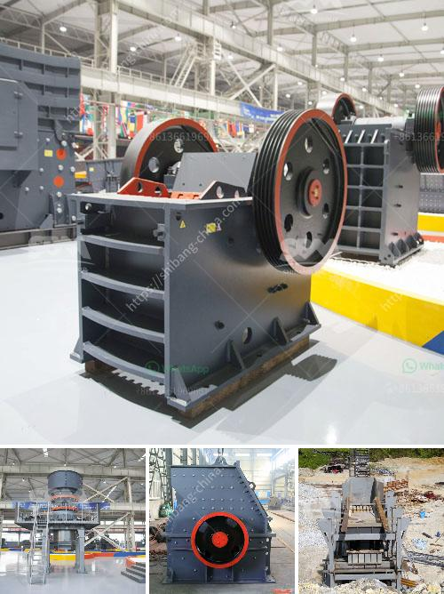

<h3>barite processing plant</h3>
Barite is a mineral found in natural deposits all around the world. It is often used as a weighting agent in drilling muds, as well as for industrial uses such as paint manufacturing and glass production. With an increasing demand for barite, the need for efficient processing methods has become crucial.

One of the most commonly used processes for barite extraction is gravity separation. This method involves crushing the ore into small particles, then using water or a heavy media to separate the barite from the gangue minerals. The resulting concentrate is then further processed to remove impurities and achieve the desired barite grade.

To facilitate the gravity separation process, a barite processing plant is essential. In this plant, gravimetric techniques are used to separate the barite from the gangue particles. Once the barite concentrate is obtained, it is further processed into various grades based on market demand.

A typical barite processing plant can include crushing, grinding, and drying stages, as well as various equipment such as vibrating feeders, crushers, vibrating screens, and magnetic separators. For the crushing stage, the barite raw ore is crushed into smaller particles, ensuring proper size for further processing.

The grinding stage is essential to obtain the desired barite particle size for efficient flotation and gravity separation. Different grinding machines are used depending on the specific requirements, including ball mills, Raymond mills, and vertical mills.

After grinding, the barite concentrate is usually mixed with water to form a slurry for further processing. Drying is then carried out to remove the moisture from the barite concentrate, resulting in a dry product with the desired barite grade.

In addition to the above processes, flotation and magnetic separation can also be employed in barite processing plants to further improve the quality and purity of the barite concentrate. These methods are particularly effective in removing impurities such as iron and manganese that can negatively affect the quality of the final product.

Overall, a well-designed barite processing plant plays a crucial role in ensuring the quality and efficiency of barite production. With the increasing demand for barite in various industries, such as oil and gas drilling, paints, and coatings, the need for reliable and efficient processing methods has never been greater.

By utilizing gravity separation, grinding, flotation, and magnetic separation techniques, barite processing plants can produce high-quality barite concentrates with excellent market value. These processed barite concentrates can then be used in a wide range of applications, contributing to the growth of various industries and the global economy as a whole.
<h3>Contact us</h3><ul><li><strong>Whatsapp:&nbsp;<a href="https://wa.me/8613661969651">+8613661969651</a></strong></li><li><a href="https://swt.shibang-china.com/?git&amp;zhl&amp;barite processing plant"><strong>Online Service(chat now)</strong></a></li></ul><h3>Related</h3><ul><li><a href='stone crusher machine south africa.md'>stone crusher machine south africa</a></li><li><a href='provider of conveyor belts for mining.md'>provider of conveyor belts for mining</a></li><li><a href='portable hammer mill australia in perth.md'>portable hammer mill australia in perth</a></li><li><a href='ball mill for pigment.md'>ball mill for pigment</a></li><li><a href='ykn vibrating screen price.md'>ykn vibrating screen price</a></li></ul>