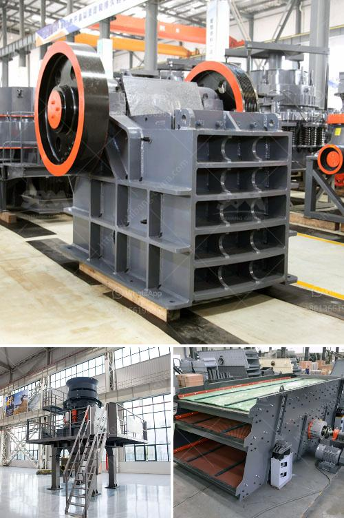

<h3>basalt crusher price in senegal</h3>
Basalt, a common igneous rock formed from the rapid cooling of lava, is widely used in construction projects due to its durability and strength. It is often crushed and used as an aggregate in concrete and asphalt mixtures, as well as in road base materials and railroad ballast. As a result, the demand for basalt crusher is constantly increasing.

Senegal, located in West Africa, is one of the countries that have abundant basalt resources. With the continuous development of infrastructure construction, the demand for basalt crusher is also growing. In order to meet the market demand, SBM Heavy Industry, a leading manufacturer, has designed a series of crushing equipment for basalt.

The basalt crusher price in Senegal is favorable and reasonable, ensuring that customers can achieve long-term benefits. With the continuous improvement of equipment technology, the traditional jaw crusher and impact crusher cannot meet the needs of high-quality aggregate production. SBM Heavy Industry has developed a new generation of efficient and energy-saving basalt crushers, such as jaw crushers, impact crushers, and cone crushers.

The jaw crusher is suitable for coarse crushing of large materials, and the impact crusher and cone crusher are used for medium and fine crushing respectively. All the equipment are advanced in technology, high in crushing efficiency, and can be adjusted to meet different production needs. In addition, they are equipped with a hydraulic system, which can effectively prevent equipment damage caused by overload.

Furthermore, SBM Heavy Industry not only provides high-quality equipment, but also provides comprehensive services. The company has a dedicated technical support team, which can provide customers with perfect pre-sale, in-sale, and after-sale services. From equipment selection, installation and commissioning, to training and maintenance, the company assists customers at every step.

In conclusion, the basalt crusher price in Senegal is cost-effective and attractive for customers. SBM Heavy Industry's high-quality equipment and excellent services have won the trust of many customers. If you have any needs in basalt crushing, feel free to contact SBM Heavy Industry for a detailed consultation.
<h3>Contact us</h3><ul><li><strong>Whatsapp:&nbsp;<a href="https://wa.me/8613661969651">+8613661969651</a></strong></li><li><a href="https://swt.shibang-china.com/?git&amp;zhl&amp;basalt crusher price in senegal"><strong>Online Service(chat now)</strong></a></li></ul><h3>Related</h3><ul><li><a href='graphite processing plant.md'>graphite processing plant</a></li><li><a href='gold mining equipment for sale in uganda.md'>gold mining equipment for sale in uganda</a></li><li><a href='cement plant equipment.md'>cement plant equipment</a></li><li><a href='small aggregate wash plants.md'>small aggregate wash plants</a></li><li><a href='vibratory feeders in south africa.md'>vibratory feeders in south africa</a></li></ul>