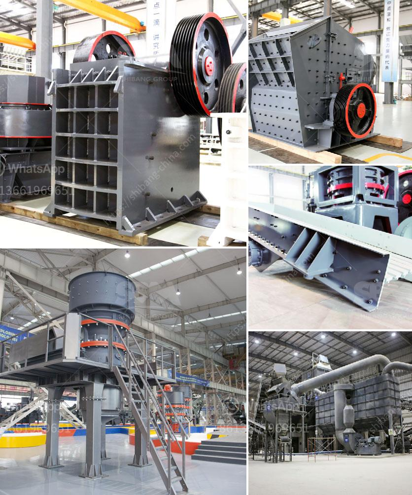

<h3>basalt crushing equipment</h3>
Basalt is a volcanic rock that is commonly found in various parts of the world. It is an igneous rock and is formed from the rapid cooling of lava. Basalt is a popular material for construction and landscaping due to its durability and aesthetic appeal.

In order to efficiently crush basalt into smaller particles, several crushing equipment are required. The primary crusher is jaw crusher, which is used to crush the basalt into smaller sizes. Secondary crusher such as impact crusher or cone crusher is also recommended for the process to produce a uniform cubical shape.

The impact crusher specifically offers high reduction ratios, which is important for the production of high-quality end products. Additionally, an impact crusher produces a consistent cubical product, creating a desirable shape for aggregate production.

Meanwhile, cone crushers are designed to crush the basalt into desired cubical size. Cone crushers are often used in secondary crushing stages to produce aggregate materials with good particle shape.

Another essential piece of equipment for basalt crushing is a vibrating screen. These screens are used to separate the crushed basalt into different sizes and to remove any fines or impurities. A vibrating screen ensures that the basalt is evenly distributed for further processing and also helps to improve the efficiency of the crushing process.

In conclusion, basalt is a popular material for construction and landscaping due to its durability and aesthetic appeal. However, in order to efficiently crush basalt into smaller particles, the use of appropriate crushing equipment is necessary. Jaw crusher, impact crusher, and cone crusher are commonly used for this purpose. Additionally, a vibrating screen is essential for the proper distribution and separation of crushed basalt. By utilizing these crushing equipment, the production of high-quality basalt materials can be achieved.
<h3>Contact us</h3><ul><li><strong>Whatsapp:&nbsp;<a href="https://wa.me/8613661969651">+8613661969651</a></strong></li><li><a href="https://swt.shibang-china.com/?git&amp;zhl&amp;basalt crushing equipment"><strong>Online Service(chat now)</strong></a></li></ul><h3>Related</h3><ul><li><a href='sand wash plant hire perth.md'>sand wash plant hire perth</a></li><li><a href='mining procedure in zambia.md'>mining procedure in zambia</a></li><li><a href='used raymond roller mills for sale.md'>used raymond roller mills for sale</a></li><li><a href='quartz powder buyers 300 mesh.md'>quartz powder buyers 300 mesh</a></li><li><a href='station de concassage daun une carriere.md'>station de concassage daun une carriere</a></li></ul>