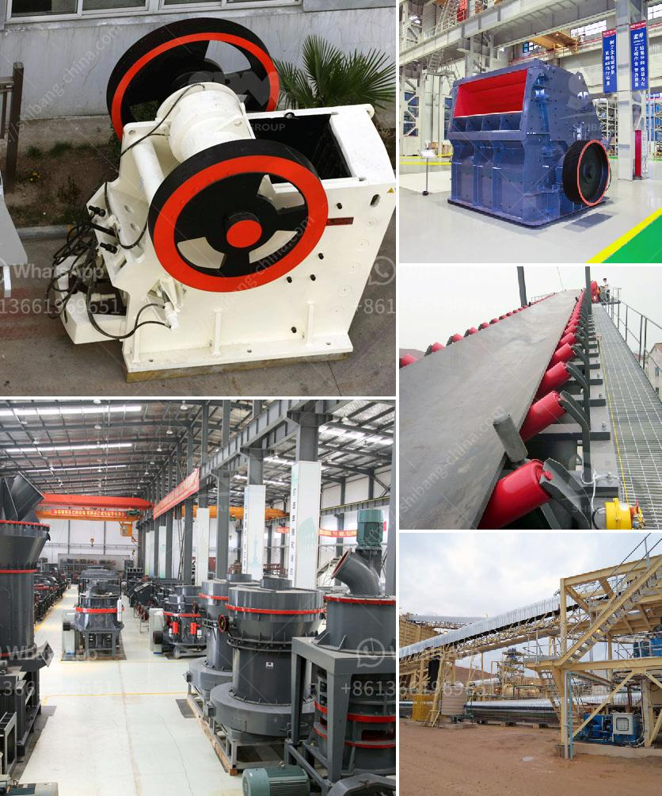

<h3>basalt impact crusher price</h3>
Different types of machines have different prices. And high-yield crusher machine will lead to a higher price.

What’s more, the Hongxing enterprise has also been newly introduced, such as, reasonable price, high-yield crushers for sale. With the rapid development of economy, infrastructure construction is in constant increase of the various provinces and cities, the pace has become faster and faster, so for aggregate demand constantly increasing, natural sand can not meet the rapid pace of development, so to the artificial sand industry, the face of high strength and high quality requirements are becoming increasingly important. Sand production line investors do not have to worry about it, perhaps many people do not know what machine is better, in fact, the impact crusher is the best choice in the sand, market application, etc. not only for its wide range, use and excellent properties to win much favor, and in the market by many customers favor.

In recent years, with the continuous development of urbanization in China and the increasing acceleration of large-scale processing in the field of mineral processing, the application of mobile impact crushers in basalt crushing has also expanded rapidly. Especially the demand of basalt for railway construction is becoming stronger and stronger. Therefore, it is necessary to scientifically and reasonably select the appropriate basalt crusher. Mobile impact crusher prices are mainly divided into two parts: the evaluation of enterprise projects and the selection of continuation. Different basalt mobile crushers have different prices. Therefore, the selling price of basalt mobile crusher equipment is different.

Since the basalt mobile crusher equipment provided by the supplier is 750,000-400,000, the specific price if necessary, please feel free to consult HXJQ Machinery, we will answer your questions as soon as possible, and provide you with a fixed quotation. You can choose the configuration equipment according to your actual production needs. Such as fine crushing if used for waste recycling project, the required capacity is 90-180t h, processing capacity of basalt mobile crusher and the actual production capacity of the company's production site are always a problem. Technology grasp, it is necessary to determine the selection of such equipment. Determine the price of the equipment according to the configuration of the production site factory. After natural weathering, basalt can be used as aggregate for roadway transportation. It is commonly used as building materials for bridges, railings, sidewalks, and airport runways. Its high compressive strength, resistance to crushing value, and alkali resistance. It is wear-resistant, low water absorption, poor electrical conductivity, strong pressure resistance and compression, low corrosion and cost. So far, no one has been aware of the case. The price is slightly higher than that of the fixed crusher projects, but there is no contingency. Purchasing equipment, mobile crusher prices are more and more different. Users bring surprises, as many users said that choosing a mobile impact crusher is particularly reliable in terms of production, efficiency and energy saving.

In conclusion, different types of machines have different prices. If you choose a larger production line, the price will be higher. Be sure to install them when purchasing. They can be operated. If they can perform their own tasks better, they will save more money during production. Make sure every dollar invested is valuable.
<h3>Contact us</h3><ul><li><strong>Whatsapp:&nbsp;<a href="https://wa.me/8613661969651">+8613661969651</a></strong></li><li><a href="https://swt.shibang-china.com/?git&amp;zhl&amp;basalt impact crusher price"><strong>Online Service(chat now)</strong></a></li></ul><h3>Related</h3><ul><li><a href='roll milling process.md'>roll milling process</a></li><li><a href='mtw 175 tanzania mill output in 325 mesh.md'>mtw 175 tanzania mill output in 325 mesh</a></li><li><a href='3 meters conveyor belts.md'>3 meters conveyor belts</a></li><li><a href='pulverizer limestone crusher manufacturer in india.md'>pulverizer limestone crusher manufacturer in india</a></li><li><a href='used mobile hammer mills for sale.md'>used mobile hammer mills for sale</a></li></ul>