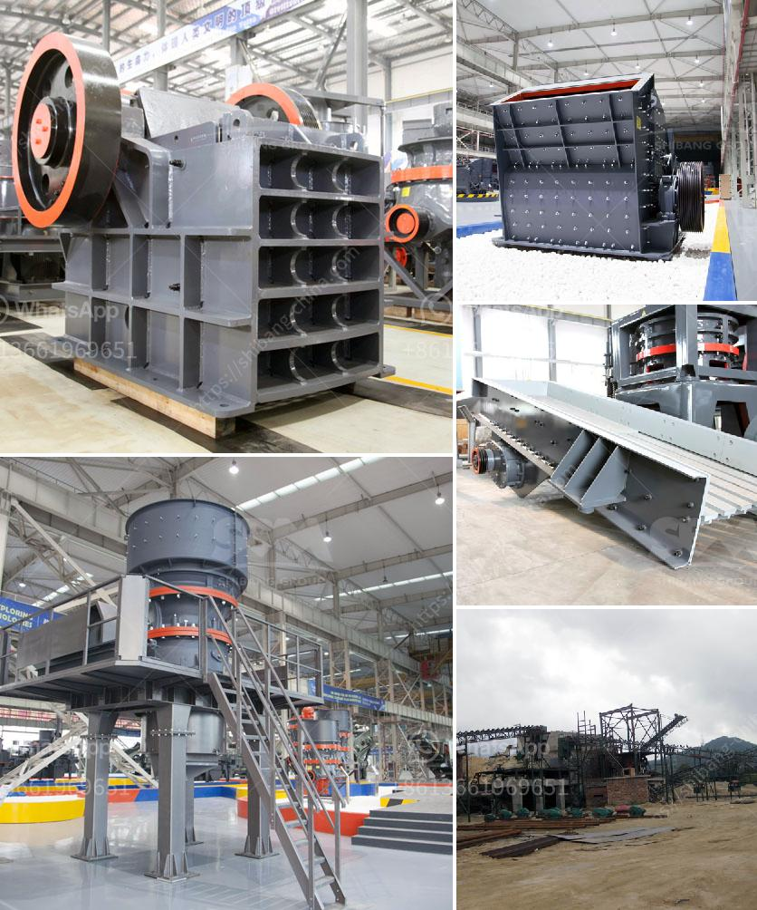

<h3>bauxite calcination plant cost in india</h3>
Bauxite is one of the important industrial minerals used in the production of aluminum. The primary ore of aluminum, bauxite, is processed to extract alumina, which is then used to produce aluminum. Bauxite is found in abundance in India; however, it requires extensive processing before it can be used for aluminum production. The process of calcination is one of the critical steps in this processing, and the establishment of a bauxite calcination plant is crucial for the extraction of alumina from bauxite ore.

The cost of a bauxite calcination plant can vary depending on the size and capacity of the plant. The cost may be higher if the plant produces more alumina per day, as more equipment and resources would be required to operate such a plant. Additionally, the cost may also depend on factors such as the location of the plant, availability of raw materials, labor costs, and government regulations.

One of the major factors influencing the cost of a bauxite calcination plant in India is the availability of bauxite ore. India has vast deposits of bauxite, making it a potentially lucrative location for the production of alumina. However, the mining and extraction of bauxite can be a complex and expensive process. The cost of acquiring and transporting bauxite ore to the calcination plant can significantly impact the overall cost of establishing a plant.

Another significant cost factor is the energy requirement for the calcination process. Calcination involves heating the bauxite ore at high temperatures to remove impurities and convert it into alumina. This process is energy-intensive and requires large amounts of electricity or fuel. The availability and cost of energy in India can impact the overall cost of operating a bauxite calcination plant.

Labor costs also play a crucial role in determining the cost of a bauxite calcination plant. India has a large workforce, and the availability of skilled labor is generally advantageous for setting up industrial plants. However, the wages and benefits provided to the workers can add to the overall cost of the plant.

Government regulations and compliance requirements can also impact the cost of establishing a bauxite calcination plant. Environmental regulations, safety standards, and permits are necessary for setting up and operating such a plant. Complying with these regulations can involve additional costs, such as investing in pollution control measures and monitoring systems.

In conclusion, the cost of establishing a bauxite calcination plant in India can vary depending on several factors. These factors include the size and capacity of the plant, availability and transportation of bauxite ore, energy requirements, labor costs, and compliance with government regulations. It is crucial for potential investors and industry stakeholders to carefully evaluate these factors to determine the feasibility and profitability of establishing a bauxite calcination plant in India.
<h3>Contact us</h3><ul><li><strong>Whatsapp:&nbsp;<a href="https://wa.me/8613661969651">+8613661969651</a></strong></li><li><a href="https://swt.shibang-china.com/?git&amp;zhl&amp;bauxite calcination plant cost in india"><strong>Online Service(chat now)</strong></a></li></ul><h3>Related</h3><ul><li><a href='3 4 inch crushed limestone.md'>3 4 inch crushed limestone</a></li><li><a href='chelyabinsk crushers price.md'>chelyabinsk crushers price</a></li><li><a href='kaolin processing line.md'>kaolin processing line</a></li><li><a href='jaw crusher south africa.md'>jaw crusher south africa</a></li><li><a href='calculation of a cost of a crusher.md'>calculation of a cost of a crusher</a></li></ul>