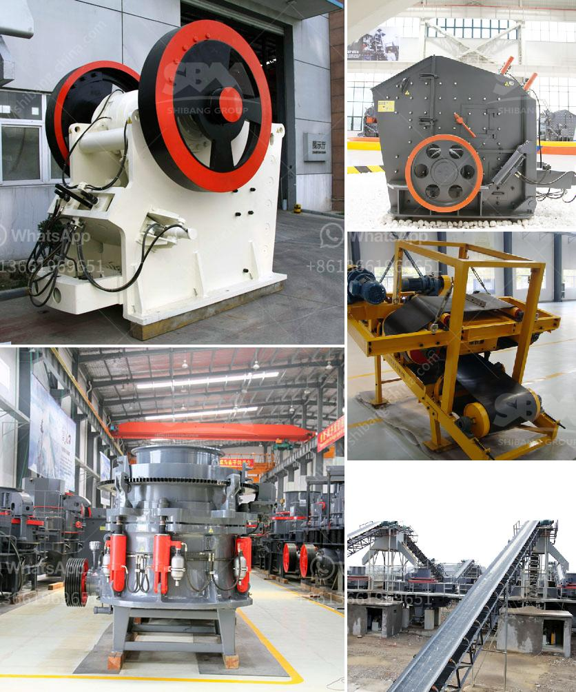

<h3>bauxite mining machine</h3>
Bauxite mining machine: a closer look at the efficient processes and methods of extracting bauxite ore

Bauxite is a mineral rock that is converted to aluminum by smelting in the production of aluminum metal, its predominant use. Bauxite is composed mainly of aluminum oxide and other minerals, such as silicates, iron oxides, and titanium oxide. Bauxite mining machine plays an important role in the production of aluminum.

Mining machines specializing in the extraction of bauxite are numerous worldwide. To meet the global bauxite demands, heavy machinery is used in the mining process. Bauxite mining machine has evolved over the years in response to the changing technological advancements, like other mining machines used in the mining industry.

To meet the requirements of mining machines, companies are investing in newer machines that offer long-term reliability, increased efficiency, and reduced downtime. These machines are designed to perform complex tasks efficiently and are built to withstand the challenging conditions and extreme environments typical of bauxite mining operations.

One such machine is a bauxite crusher that can break bauxite into particles of a certain size for further grinding and beneficiating operations. The crushing and grinding of bauxite require the use of reliable and energy-efficient equipment. This machine relies on its unique grinding motion to grind and crush bauxite rocks or ores efficiently.

Another machine used in bauxite mining is a hammer crusher. It focuses on pulverizing and crushing raw materials, providing optimally sized raw materials for the smelting process. The machine uses high-speed rotating hammerheads to impact and crush materials, ensuring efficient crushing of bauxite.

In addition, bauxite mining machines from other companies can provide assistance in the purification of bauxite ore, as well as the subsequent separation of aluminum oxide from the other metallurgical components found in the mineral. This involves crushing and refining the bauxite ore to obtain pure aluminum oxide.

As a professional supplier of bauxite mining equipment, SBM has been specialized in mining industry for several decades. We are global supplier of crushing, grinding, and processing equipment. We developed complete series of bauxite beneficiation plant in Australia, Brazil, Guinea, Jamaica, India, Indonesia, Iraq, Ireland, Norway, Pakistan, South Africa, Saudi Arabia, Sudan, Thailand, Turkey, and Russia.

Our machines have found a successful application in bauxite processing plant for sale; Germany stone crusher machine; Bentonite beneficiation equipment; Chrome ore beneficiation plant; Granite Crushing Plant Price; Tin Ore Processing Line In Uganda; Copper Ore Processing Line In Finland. Our engineers focus on improving the design of machines and reducing the overall cost of ownership. We also provide training, handbooks, and on-site support to improve the efficiency and productivity of the machines.

In conclusion, bauxite mining machine is a kind of complex equipment and machinery that is used for performing mining operations, such as crushing, grinding, and screening. Bauxite is a sedimentary rock that is found in the earth's crust, and it mainly consists of aluminum oxide compounds (alumina), silica, iron oxides, and titanium dioxide.
<h3>Contact us</h3><ul><li><strong>Whatsapp:&nbsp;<a href="https://wa.me/8613661969651">+8613661969651</a></strong></li><li><a href="https://swt.shibang-china.com/?git&amp;zhl&amp;bauxite mining machine"><strong>Online Service(chat now)</strong></a></li></ul><h3>Related</h3><ul><li><a href='drawing for raymond mill.md'>drawing for raymond mill</a></li><li><a href='pebble crushing line.md'>pebble crushing line</a></li><li><a href='sandstone crusher.md'>sandstone crusher</a></li><li><a href='how to start a quarry business in nigeria.md'>how to start a quarry business in nigeria</a></li><li><a href='rock jaw crusher.md'>rock jaw crusher</a></li></ul>