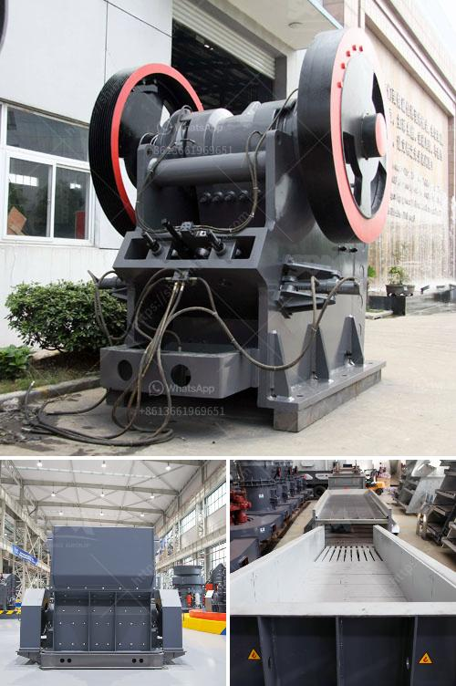

<h3>belt conveyor manufacturers in indonesia</h3>
Indonesia is a country that is known for its natural resources and mining activities. With such an abundance of raw materials, it is no wonder that there is a thriving industry of belt conveyor manufacturers in the country. Belt conveyors are essential tools in mining and other industrial sectors, providing a reliable and efficient method of transporting goods and materials.

One of the leading belt conveyor manufacturers in Indonesia is PT. Sentra Aneka Tama. Located in Jakarta, this company has years of experience in providing various types of conveyor belts and accessories. PT. Sentra Aneka Tama offers various types of conveyor belts such as textile conveyor belts, steel cord conveyor belts, and chevron belts.

This company is well-known for its excellent quality and reliable performance. It takes pride in using high-quality raw materials and state-of-the-art manufacturing techniques to produce their conveyor belts. They are also dedicated to providing excellent customer service, ensuring that their clients receive the best support and assistance in choosing the right conveyor belts for their needs.

Another prominent belt conveyor manufacturer in Indonesia is PT. Bando Indonesia. Established in 1987, this company has been supplying a wide range of conveyor belts to local industries for over three decades. PT. Bando Indonesia prides itself as a leader in belt manufacturing, producing a wide variety of conveyor belts including textured, anti-static, heat resistant, oil-resistant, flame-resistant, and many more.

PT. Bando Indonesia boasts a well-equipped manufacturing facility and a team of highly skilled professionals who are committed to producing high-quality conveyor belts that meet international standards. The company also focuses on continuous improvement and research and development to stay at the forefront of industry trends and advancements.

In conclusion, the presence of quality belt conveyor manufacturers in Indonesia proves the country's commitment to its mining and industrial sectors. With their reliable, efficient, and durable conveyor belts, these manufacturers play a crucial role in ensuring the smooth functioning of various industries in the country. Whether it be transporting raw materials or finished products, belt conveyor manufacturers in Indonesia are trusted partners for businesses that require efficient material handling solutions.
<h3>Contact us</h3><ul><li><strong>Whatsapp:&nbsp;<a href="https://wa.me/8613661969651">+8613661969651</a></strong></li><li><a href="https://swt.shibang-china.com/?git&amp;zhl&amp;belt conveyor manufacturers in indonesia"><strong>Online Service(chat now)</strong></a></li></ul><h3>Related</h3><ul><li><a href='ball mill in egypt.md'>ball mill in egypt</a></li><li><a href='sale of stone hammer hammer.md'>sale of stone hammer hammer</a></li><li><a href='stationary jaw crusher.md'>stationary jaw crusher</a></li><li><a href='clay grinding machine for sale china.md'>clay grinding machine for sale china</a></li><li><a href='small scale rock grizzly separator.md'>small scale rock grizzly separator</a></li></ul>