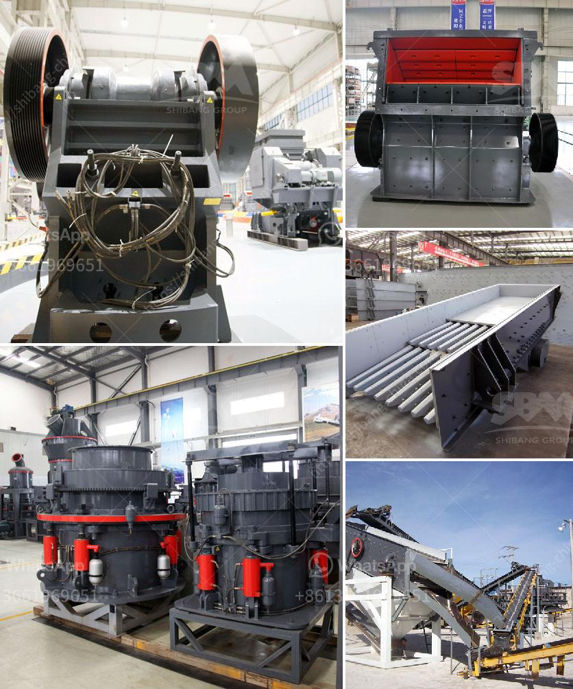

<h3>beneficiation of iron ore in dry methods</h3>
Iron ores are rocks and minerals from which metallic iron can be extracted. The ores are usually rich in iron oxides and vary in color from dark grey, bright yellow, or deep purple to rusty red. The iron itself is usually found in the form of magnetite (Fe3O4), hematite (Fe2O3), goethite (FeO(OH)), limonite (FeO(OH) · n(H2O)) or siderite (FeCO3). Ores containing very high quantities of hematite or magnetite are known as "natural ore" or "direct shipping ore", meaning they can be fed directly into iron-making blast furnaces.

The extraction of iron ore involves two major methods: wet and dry. The wet process involves breaking down the ore into smaller pieces and washing with water to separate the impurities from the iron ore. This process produces a higher grade concentrate, typically with iron content of around 64-68%. The remaining iron ore is then dried and the water content is reduced to approximately 10-14%.

The dry process, on the other hand, does not require the use of water. Instead, the iron ore is processed dry, followed by screening and then dry magnetic separation. The results show that the dry method can effectively improve the efficiency of magnetite ore processing. The grade of concentrate obtained by using the dry process is higher than that obtained utilizing the wet process. Dry beneficiation of iron ore offers a better alternative approach for iron ore beneficiation in terms of cost and environmental considerations.

The widespread adoption of dry beneficiation of iron ore would provide substantial benefits to the iron ore industry and the economy in general. Finally, dry magnetic separation allows the economical and sustainable processing of ores with a declining grade and complex mineralogy.

The dry iron ore beneficiation technique utilised will extract a higher quality product to niche markets, especially since steel producers have ongoing projects that require ore of the highest quality. Operations using dry magnetic separation methods are gaining traction in China and Sweden (Du and Li, 2020).

The dry beneficiation process of iron ore has a number of unique advantages that differentiate it from the wet process. The dry beneficiation process completely eliminates the use of water, which helps in reducing the environmental impact of the tailings disposal process. Dry beneficiation also eliminates the risk of water pollution, which is common in the conventional wet beneficiation process.

Moreover, dry beneficiation provides a more efficient and cost-effective solution compared to wet beneficiation methods. Dry processing requires less equipment and machinery, is less complicated, and is less prone to technical glitches. It also eliminates the need for expensive water treatment facilities and reduces energy consumption.

In conclusion, dry beneficiation of iron ore offers a better alternative approach for iron ore beneficiation. It eliminates the costs associated with the use of water and subsequent tailings disposal, and offers an environmentally friendly solution for iron ore producers. Furthermore, dry iron ore beneficiation saves investment costs, reduces the environmental impact, and improves product quality. As a result, dry processing of iron ore presents an opportunity to fill a gap in the market and contribute to the sustainability of the industry.
<h3>Contact us</h3><ul><li><strong>Whatsapp:&nbsp;<a href="https://wa.me/8613661969651">+8613661969651</a></strong></li><li><a href="https://swt.shibang-china.com/?git&amp;zhl&amp;beneficiation of iron ore in dry methods"><strong>Online Service(chat now)</strong></a></li></ul><h3>Related</h3><ul><li><a href='mining equipment bow mills in zimbabwe.md'>mining equipment bow mills in zimbabwe</a></li><li><a href='equipos para triturado de mineria.md'>equipos para triturado de mineria</a></li><li><a href='chinese manufacturer for crusher screens vibrating feeders.md'>chinese manufacturer for crusher screens vibrating feeders</a></li><li><a href='gypsum powder industry basic machines.md'>gypsum powder industry basic machines</a></li><li><a href='desain mesin crusher tempurung kelapa.md'>desain mesin crusher tempurung kelapa</a></li></ul>