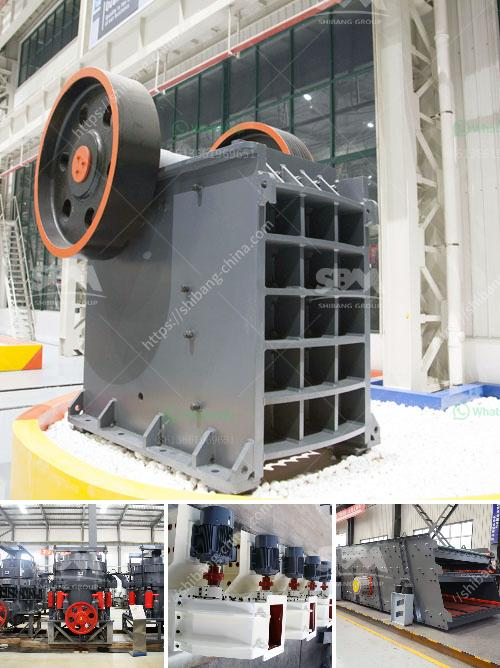

<h3>beneficiation of iron ore suppliers</h3>
The beneficiation of iron ore suppliers is a key process in the iron-making industry. The impact of this process on the environment is important since it can transform the pollutant emissions profiles of the iron-making process. Environmental legislation imposes restrictions on the classification and pollution control of waste and by-products generated from the iron ore beneficiation process.

Suppliers of iron ore beneficiation technologies can assist the mining companies in the development of a sustainable beneficiation plant. Efficiencies in this process can help decrease energy consumption and reduce greenhouse gas emissions. Suppliers play a critical role as they provide the technology and expertise required for extracting valuable minerals from mined ore. This process is essential for iron ore, as it provides a high-purity final product suitable for steelmaking.

There are several suppliers of iron ore beneficiation technologies in the market. These suppliers offer a variety of technologies to improve the performance and productivity of the beneficiation process. Some technologies focus on enhancing the magnetic separation of iron ore, while others aid in increasing the iron content through flotation or gravity separation. Selecting the right supplier is crucial for achieving the desired outcomes of the beneficiation process.

One key factor to consider when evaluating beneficiation suppliers is their experience and track record in the industry. Established suppliers with a proven history of successful projects are more likely to deliver reliable and efficient solutions. Their expertise allows for the optimization of the beneficiation process, resulting in improved resource recovery and cost efficiencies.

Another factor to consider when selecting a supplier is the sustainability of their solutions. With increasing environmental concerns, it is important to choose a supplier that promotes sustainable practices in the beneficiation process. Technologies that minimize the generation of waste and reduce the environmental footprint of the industry should be prioritized.

Suppliers that provide innovative solutions and continuously invest in research and development are also valuable partners. The iron ore beneficiation process is constantly evolving, and advancements in technology can offer significant improvements in efficiency and resource recovery. Suppliers that invest in R&D can provide cutting-edge solutions that enhance the overall performance of the beneficiation process.

Collaboration with suppliers is essential in the beneficiation of iron ore. Close cooperation allows for the exchange of knowledge and expertise, enabling mining companies to make informed decisions. Suppliers can assist in identifying the best beneficiation technologies for a specific ore deposit and provide support throughout the implementation process.

In conclusion, the role of suppliers in the beneficiation of iron ore is crucial. They provide the technology, expertise, and innovation necessary to optimize the beneficiation process and meet the environmental requirements imposed by legislation. Choosing the right supplier based on their experience, sustainability practices, and commitment to research and development is essential for achieving efficient and sustainable iron ore beneficiation.
<h3>Contact us</h3><ul><li><strong>Whatsapp:&nbsp;<a href="https://wa.me/8613661969651">+8613661969651</a></strong></li><li><a href="https://swt.shibang-china.com/?git&amp;zhl&amp;beneficiation of iron ore suppliers"><strong>Online Service(chat now)</strong></a></li></ul><h3>Related</h3><ul><li><a href='mining process of limestone.md'>mining process of limestone</a></li><li><a href='mobile stone crusher gauteng.md'>mobile stone crusher gauteng</a></li><li><a href='list of cement plant in india.md'>list of cement plant in india</a></li><li><a href='grinding machine 2 micron for calcium carbonate.md'>grinding machine 2 micron for calcium carbonate</a></li><li><a href='best marble grinder mill.md'>best marble grinder mill</a></li></ul>