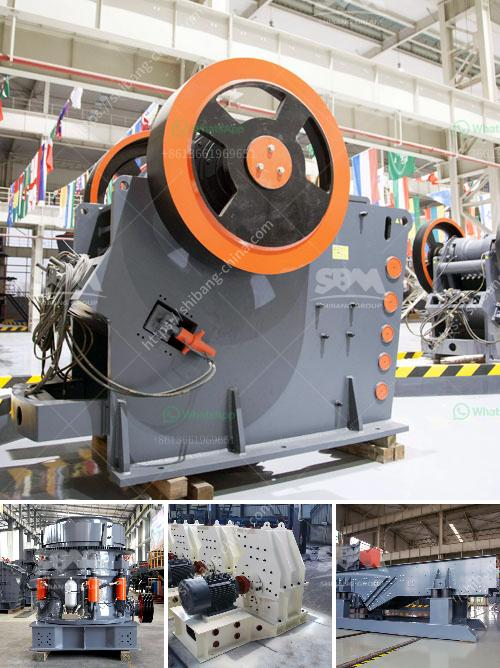

<h3>bentonite crusher machine</h3>
Bentonite is a very important and useful substance in various industrial applications. It is the primary component in drilling muds, foundry sands, and pelletizing of iron ore fines. Bentonite is also used as a binding agent in the production of iron ore pellets, as well as a desiccant for cat litter. The process of mining bentonite ore involves a series of crushing, drying, and milling stages to produce a desired particle size range.

In terms of the bentonite ore crusher, it is mainly used for crushing the bentonite raw materials into fine powders. While, there are primary crusher and secondary crusher for bentonite crushing process. SBM has been always providing our customers the best machines and the most professional service to attract more and more customers.

According to the different production needs, we make the different configuration for our customers. For example, customers can choose jaw crusher, impact crusher or cone crusher in the first crushing stage. In the second crushing stage, we recommend customers choose impact crusher or cone crusher compared with the traditional jaw crusher, as it can process finer bentonite materials. Thirdly, customers can choose sand making machine instead of cone crusher or impact crusher. Besides, if we adopt VSI crusher, you need one vibrating screen and sand washer to form a complete production line.

With the unique vortex type three crushing cavities of the impact crusher, it produces the final product of high quality aggregate with character of uniformity in size and cubical in shape. Spring Cone Crusher has different types of crushing chamber for choosing according to crushing process. Working Principle: Motor drives eccentric sleeve rotation through belt work, drive shaft, bevel gear pair, moving cone to do in the role of eccentric sleeve the spin pendulum movement movable cone and fixed cone sometimes near sometimes deviate from.

The material is being squeezed and crushed in the crushing chamber, it is discharged from the bottom. With the structure of continuous rotation, the realization of automatic control, this crusher efficiently fulfills the need of breaking large, medium and small size crude bentonite into uniform particle sizes.

In the whole production line, the bentonite will be grinded into the powder form or particle form. Limestone powder grinding machine full set price,Limestone production line. Gulin? is a manufacturer and supplier of limestone grinding mill and Gulin supplies limestone crushers for fine and medium crushing of ores and rocks with compressive strength less than 300 Mpa.

Raymond mill, high pressure mill, trapezium mill and other kinds of mills will be used, such as bentonite ore crusher, bentonite grinding mill, b

entonite ore crusher, bentonite grinding mill, bentonite ore mill, etc. In addition, related equipment such as circular vibrating screens, coarse and fine powders will be separated or sieved by vibrating screens and divided into different particle sizes by cyclone separators. Finally, the required bentonite powder will be discharged.

In summary, the bentonite processing plant generally includes the crushing, grinding, beneficiation and drying stages. The bentonite ore will be sent into the primary crusher machine for crushing and then sent into the vibrating screen for screening. The vibrating screen will separate the large particles out into different sizes and the belt conveyor will send them back to the crusher machine for re-crushing. The crushed material from the sand making machine will be transported to another or the same vibrating screen for separating. The final product will be separated into different sizes.
<h3>Contact us</h3><ul><li><strong>Whatsapp:&nbsp;<a href="https://wa.me/8613661969651">+8613661969651</a></strong></li><li><a href="https://swt.shibang-china.com/?git&amp;zhl&amp;bentonite crusher machine"><strong>Online Service(chat now)</strong></a></li></ul><h3>Related</h3><ul><li><a href='gemstone mining in zambia.md'>gemstone mining in zambia</a></li><li><a href='quartz making machine germany.md'>quartz making machine germany</a></li><li><a href='scm ultra fine hammer mill price.md'>scm ultra fine hammer mill price</a></li><li><a href='rock jaw crusher.md'>rock jaw crusher</a></li><li><a href='high purity quartz crusher processing.md'>high purity quartz crusher processing</a></li></ul>