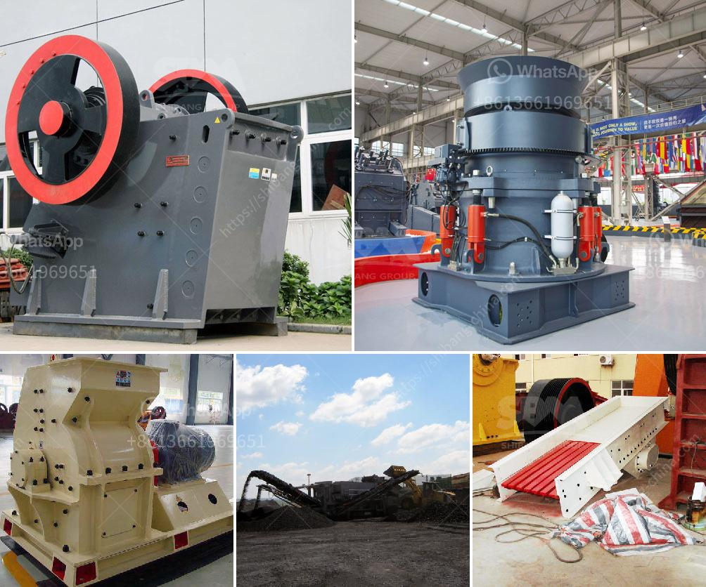

<h3>bentonite milling plant</h3>
Bentonite is a natural occurrence of clay which is widely used in various industrial applications due to its versatile properties. It is formed from the weathering of volcanic ash and is commonly found in various parts of the world. Bentonite has unique characteristics such as high water absorption capacity, ability to form a gel when mixed with water, and excellent rheological properties, making it highly desirable in many industries.

One of the key processes involved in utilizing bentonite is milling. Bentonite milling plants are typically designed with several components to ensure high processing efficiency and maximum productivity. The main components of a bentonite milling plant include a primary crusher, a secondary crusher, a storage silo, and conveying systems. The milling process involves breaking down the large chunks of bentonite into smaller particles suitable for further processing.

The primary crusher is responsible for reducing the size of the raw bentonite material to a more manageable size. It usually employs a jaw crusher or a gyratory crusher to achieve this task. The secondary crusher further breaks down the material into finer particles, ensuring that the resulting bentonite powder is of the desired quality and consistency.

Once the raw bentonite is crushed, it is stored in a storage silo for further processing. The storage silo serves as a buffer, allowing the milling plant to operate continuously even when the supply of raw material fluctuates. From the storage silo, the bentonite is transported to the milling equipment through a series of conveying systems, such as belt conveyors or screw conveyors. These conveyors ensure a smooth and efficient transfer of the material, minimizing any potential material losses or contamination.

In the milling process, the bentonite is further pulverized to achieve the desired particle size distribution. This is typically done using specialized milling equipment such as a Raymond mill or a vertical roller mill. These mills have the capability to grind the bentonite into micron-sized particles, ensuring the optimal utilization of the material's unique properties.

After the milling process, the bentonite powder is ready for further processing or packaging. Depending on the specific application, the powder may undergo additional treatment such as drying, sieving, or blending with other additives. This ensures that the final product meets the required specifications and provides the desired performance in various industrial applications.

In conclusion, bentonite milling plants play a crucial role in the processing of bentonite for various industrial applications. These plants are designed to efficiently break down the raw material into fine particles and ensure maximum productivity. With the right equipment and processes, bentonite can be milled to meet the required specifications, making it an invaluable resource in industries such as construction, agriculture, and cosmetics.
<h3>Contact us</h3><ul><li><strong>Whatsapp:&nbsp;<a href="https://wa.me/8613661969651">+8613661969651</a></strong></li><li><a href="https://swt.shibang-china.com/?git&amp;zhl&amp;bentonite milling plant"><strong>Online Service(chat now)</strong></a></li></ul><h3>Related</h3><ul><li><a href='cost of gold bow mill for sale in south africa.md'>cost of gold bow mill for sale in south africa</a></li><li><a href='india conveyor belt for stone crusher.md'>india conveyor belt for stone crusher</a></li><li><a href='stone mill grinder appliances made in china.md'>stone mill grinder appliances made in china</a></li><li><a href='gold mining industry in tanzania.md'>gold mining industry in tanzania</a></li><li><a href='how much does gold ore cost.md'>how much does gold ore cost</a></li></ul>