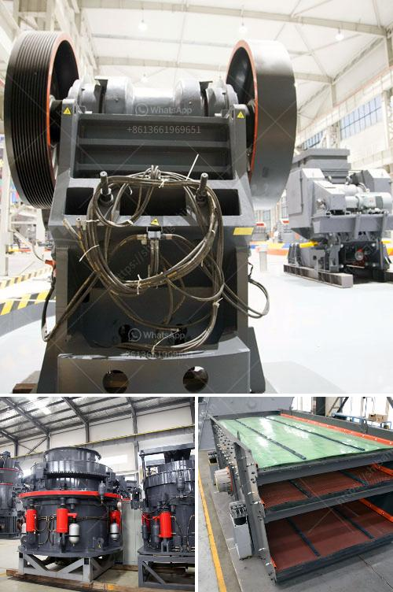

<h3>berat mobile screen mobile crusher</h3>
In today's fast-paced world, mobile technology has become an integral part of our lives. From phones to tablets, we rely on these devices to stay connected and entertained on the go. With the increasing demand for mobile crushers, companies have been continually innovating to provide efficient and portable solutions. One such innovation is the berat mobile screen mobile crusher.

The berat mobile screen mobile crusher offers a compact and versatile solution for crushing and screening applications. With its portable design, it can be easily transported from one location to another, making it ideal for construction sites, mines, quarries, and more. Whether you need to crush rocks, concrete, or asphalt, this mobile crusher can handle it all.

What sets the berat mobile screen mobile crusher apart from its competitors is its high-quality and durable construction. It is made from strong materials that can withstand the toughest conditions, ensuring long-lasting performance. The crusher is also designed to be user-friendly, with intuitive controls and a simple interface, making it easy for operators to operate and maintain.

Another key feature of the berat mobile screen mobile crusher is its efficient screening capability. Its mobile screen can separate different sizes of materials, ensuring that only the desired product is produced. This saves time and resources by reducing the need for additional screening equipment.

Furthermore, the berat mobile screen mobile crusher offers excellent flexibility and adaptability. It can be easily customized to meet specific requirements and processes, allowing it to handle various materials and produce different sizes of products. Whether you need a primary crushing unit or a secondary crusher, this mobile crusher can be tailored to fit your needs.

In conclusion, the berat mobile screen mobile crusher is a game-changer in the world of portable crushing. Its compact design, high-quality construction, and efficient screening capability make it the ultimate solution for on-the-go crushing. With this mobile crusher, you can take your crushing and screening operations to the next level, increasing productivity and profitability. So, if you're in need of a reliable and portable crushing solution, look no further than the berat mobile screen mobile crusher.
<h3>Contact us</h3><ul><li><strong>Whatsapp:&nbsp;<a href="https://wa.me/8613661969651">+8613661969651</a></strong></li><li><a href="https://swt.shibang-china.com/?git&amp;zhl&amp;berat mobile screen mobile crusher"><strong>Online Service(chat now)</strong></a></li></ul><h3>Related</h3><ul><li><a href='mobile stone crusher gauteng.md'>mobile stone crusher gauteng</a></li><li><a href='distributor jaw crusher merk khong chuan.md'>distributor jaw crusher merk khong chuan</a></li><li><a href='stone crusher for sale philippine.md'>stone crusher for sale philippine</a></li><li><a href='mobile jaw crusher dealers south africa.md'>mobile jaw crusher dealers south africa</a></li><li><a href='diamond screening plant for hire south africa.md'>diamond screening plant for hire south africa</a></li></ul>