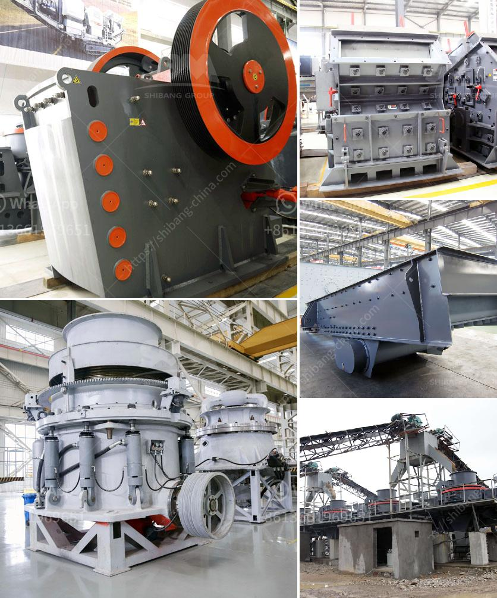

<h3>best crusher for quartz powder</h3>
Quartz is a common mineral found in many rocks, primarily known for its hardness and durability. It is used in a variety of industries, including construction, electronics, and jewelry making. To produce quartz powder, the rock is crushed into smaller particles using a crusher. This article will explore the best crushers for quartz powder, highlighting their key features and benefits.

The jaw crusher is a highly efficient crusher that is designed to crush even the hardest quartz crystals. It is capable of breaking large quartz rocks into smaller particles with its powerful jaws. The jaw crusher consists of a fixed jaw plate and a moving jaw plate. When the quartz rocks are fed into the crusher, the moving jaw compresses the rock against the fixed jaw, crushing it into smaller pieces. The crushed quartz particles can then be further processed into quartz powder.

- High crushing ratio: The jaw crusher provides a high reduction ratio, ensuring efficient crushing of quartz rocks.

- Durability: Due to its sturdy construction, the jaw crusher is able to withstand the high pressure exerted during the crushing process.

- Versatility: The jaw crusher can handle a wide range of quartz rock sizes and shapes, making it suitable for various applications.

The cone crusher is another popular choice for crushing quartz rocks into powder. It utilizes a rotating mantle and an eccentrically gyrating spindle to crush the rocks between the mantle and the concave. As the quartz rocks are fed into the crusher, they are gradually crushed and discharged from the bottom.

- Efficient operation: The cone crusher's design enables it to handle large volumes of quartz rocks, making it ideal for crushing operations with high production demands.

- Uniform particle size: The cone crusher produces uniform-sized particles, ensuring consistent quality quartz powder.

- Easy maintenance: The cone crusher's simple design allows for easy maintenance and repairs, minimizing downtime.

The impact crusher is known for its high crushing efficiency and ability to produce well-shaped quartz powder. It utilizes intense impact forces to crush quartz rocks against a fixed plate or rotor. The crushed quartz particles are then ejected through adjustable openings at the bottom of the crusher.

- Superior particle shape: The impact crusher produces well-shaped quartz particles, reducing the need for further processing.

- High productivity: The impact crusher's high-speed rotor allows for rapid crushing of quartz rocks, ensuring high production rates.

- Versatile applications: The impact crusher can be used to crush quartz rocks of various sizes and hardness levels.

In conclusion, selecting the best crusher for quartz powder depends on various factors, including the desired particle size, production requirements, and the hardness of the quartz rocks. Whether it is a jaw crusher, cone crusher, or impact crusher, each option offers unique advantages for efficiently crushing quartz and producing high-quality quartz powder. Ultimately, it is important to consider the specific needs of your application to determine the best crusher for your quartz powder production.
<h3>Contact us</h3><ul><li><strong>Whatsapp:&nbsp;<a href="https://wa.me/8613661969651">+8613661969651</a></strong></li><li><a href="https://swt.shibang-china.com/?git&amp;zhl&amp;best crusher for quartz powder"><strong>Online Service(chat now)</strong></a></li></ul><h3>Related</h3><ul><li><a href='jaw crusher thailand.md'>jaw crusher thailand</a></li><li><a href='barite and bentonite mining companies.md'>barite and bentonite mining companies</a></li><li><a href='providers conveyor belts in mexico.md'>providers conveyor belts in mexico</a></li><li><a href='iron ore beneficiation flowsheet.md'>iron ore beneficiation flowsheet</a></li><li><a href='graphite processing plant.md'>graphite processing plant</a></li></ul>