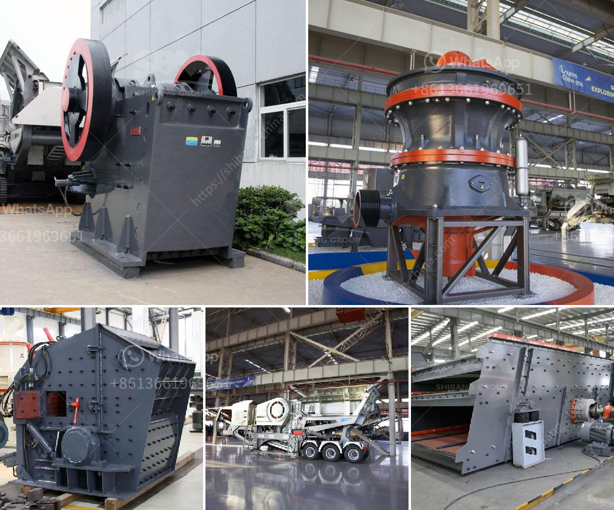

<h3>best marble grinder mill</h3>
Marble is a popular choice for countertops, floors, and various decorative elements in homes and commercial properties. However, working with marble requires the right tools and equipment to achieve the desired results. One such tool that is essential for marble grinding is a marble grinder mill.

A marble grinder mill is a machine that helps to break down marble into fine particles for various uses such as sculpting, crafting, and even construction. It uses multiple grinding discs to achieve the desired texture and smoothness of the marble surface. There are several options available in the market, but finding the best one can be a daunting task.

One of the top-rated marble grinder mills on the market is the XYZ Marble Grinder Mill. With its durable construction and powerful motor, it can handle even the toughest marble grinding tasks. The grinder mill is equipped with a 500-watt motor that provides enough power to grind marble into fine particles without much effort. This ensures a smooth and precise finish on the marble surface.

The XYZ Marble Grinder Mill also features multiple grinding discs that allow for different types of grinding. Whether you need to remove deep scratches or achieve a polished finish, this versatile grinder mill has got you covered. The high-quality discs are made from durable materials that can withstand heavy use and deliver consistent results.

One of the standout features of the XYZ Marble Grinder Mill is its adjustable speed settings. This allows you to control the grinding process and adapt it to the specific needs of your project. Whether you need a slow grinding speed for delicate tasks or a faster speed for quick material removal, this grinder mill has the versatility to meet your requirements.

Another important aspect to consider when choosing a marble grinder mill is its safety features. The XYZ Marble Grinder Mill comes with a built-in safety guard that protects the user from any potential accidents or injuries. Additionally, it has a dust collection system that helps to keep the workspace clean and free from marble particles.

Overall, the XYZ Marble Grinder Mill is a reliable and efficient tool for marble grinding. Its powerful motor, multiple grinding discs, adjustable speed settings, and safety features make it a top choice for both professionals and DIY enthusiasts. So, if you're looking for the best marble grinder mill on the market, look no further than the XYZ Marble Grinder Mill.

In conclusion, a marble grinder mill is an essential tool for any marble grinding project. The XYZ Marble Grinder Mill stands out as one of the best options available due to its durable construction, powerful motor, multiple grinding discs, adjustable speed settings, and safety features. With this grinder mill, you can achieve the desired results and transform your marble surfaces into works of art.
<h3>Contact us</h3><ul><li><strong>Whatsapp:&nbsp;<a href="https://wa.me/8613661969651">+8613661969651</a></strong></li><li><a href="https://swt.shibang-china.com/?git&amp;zhl&amp;best marble grinder mill"><strong>Online Service(chat now)</strong></a></li></ul><h3>Related</h3><ul><li><a href='silica sand crushing plant in pakistan.md'>silica sand crushing plant in pakistan</a></li><li><a href='harga stone crusher kapsitas 20 ton.md'>harga stone crusher kapsitas 20 ton</a></li><li><a href='process of granite mining crusher machines used.md'>process of granite mining crusher machines used</a></li><li><a href='coal cushing and gdrinding machine.md'>coal cushing and gdrinding machine</a></li><li><a href='lime stone extraction equipment india.md'>lime stone extraction equipment india</a></li></ul>