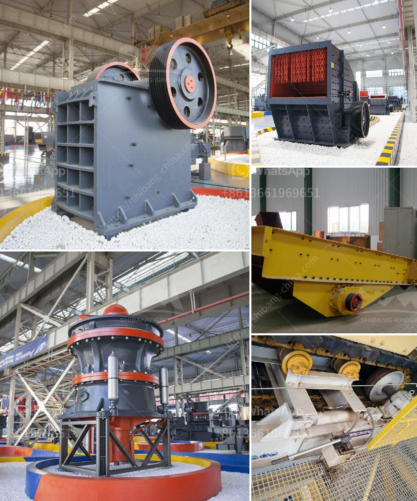

<h3>bimach grinding marble</h3>
Marble has always been a sought-after material for various construction and design projects. Its luxurious appearance and timeless beauty make it a popular choice for flooring, countertops, and other decorative elements in both residential and commercial spaces. However, working with marble can be a challenging endeavor, and achieving the desired finish requires skilled craftsmanship and proper tools. This is where Bimach Grinding comes into the picture.

Bimach Grinding is a specialized technique used to enhance the aesthetics of marble surfaces. It involves the use of diamond abrasive pads or stones to smooth and polish the material, resulting in a glossy and mirror-like finish. This process helps to bring out the natural colors and patterns of the stone, highlighting its unique characteristics.

One of the primary advantages of Bimach Grinding is its ability to remove surface imperfections such as scratches, stains, and etch marks. Over time, marble surfaces can become dull and damaged due to regular usage and exposure to various elements. The grinding process effectively levels the surface, eliminating any unevenness or blemishes, and restoring the stone's original glory.

Moreover, Bimach Grinding is a versatile technique that can be applied to various marble surfaces, including floors, walls, stairs, and countertops. Whether you have a small residential project or a large-scale commercial venture, this method offers a high degree of flexibility and adaptability. It allows architects and designers to explore creative possibilities, experimenting with different finishes and textures to meet their clients' specific preferences and requirements.

Another significant advantage of Bimach Grinding is the durability it provides to the marble surface. The smooth and polished finish achieved through this process enhances the stone's resistance to wear and tear. It becomes less prone to scratches, staining, and other damages caused by regular usage. This added longevity can be particularly beneficial in high-traffic areas such as hotels, shopping malls, or office buildings, where the flooring is subjected to constant foot traffic and potential spills.

In addition to its aesthetic and durability benefits, Bimach Grinding also offers advantages in terms of maintenance. The smooth finish attained through this technique makes the marble surface easier to clean and maintain. Dust, dirt, and spills can be quickly wiped away, and regular maintenance routines become more manageable, saving time and effort.

However, it is crucial to note that Bimach Grinding should be carried out by professionals experienced in this field. The process requires expertise and specialized equipment to ensure optimal results. Therefore, it is essential to hire reputable contractors who possess the necessary skills and knowledge to deliver a flawless finish.

In conclusion, Bimach Grinding is a sophisticated technique that brings out the natural beauty of marble. By eliminating imperfections and creating a smooth and glossy finish, it enhances the aesthetics and durability of the stone surfaces. Whether you're renovating a residential space or designing a commercial establishment, Bimach Grinding offers a wide range of benefits. Just remember to entrust this task to experienced professionals to achieve the desired outcome for your project.
<h3>Contact us</h3><ul><li><strong>Whatsapp:&nbsp;<a href="https://wa.me/8613661969651">+8613661969651</a></strong></li><li><a href="https://swt.shibang-china.com/?git&amp;zhl&amp;bimach grinding marble"><strong>Online Service(chat now)</strong></a></li></ul><h3>Related</h3><ul><li><a href='gypsum board making machinery.md'>gypsum board making machinery</a></li><li><a href='stone crusher finance project myanmar.md'>stone crusher finance project myanmar</a></li><li><a href='stone crusher output.md'>stone crusher output</a></li><li><a href='ghana quarry crusher.md'>ghana quarry crusher</a></li><li><a href='ball mill suppliers uk.md'>ball mill suppliers uk</a></li></ul>